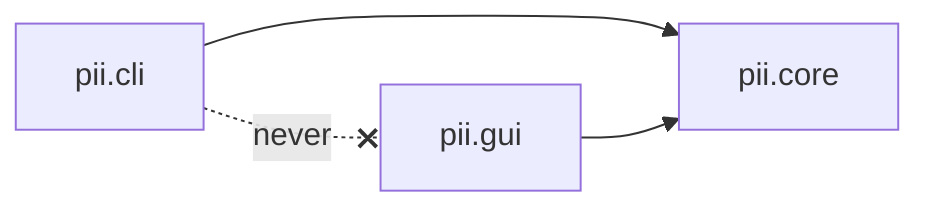

# PII Tool — Architecture (umbrella)

The PII tool (Phase 1 of the [BrokerAI revival](../ARCHITECTURE.md)) is split into three
components, each a Python subpackage of `pii/` with its own doc set. This umbrella file owns
the **component boundary and dependency rules**; each component's own design lives in its
`ARCHITECTURE.md`.

## Components

| Component | Package | Role | Docs |
|---|---|---|---|
| **Core** (engine) | `pii.core` | Detection + pseudonymization pipeline: Presidio + custom AU recognizers, GLiNER2 NER, CSV/image modes, OCR, pseudonym mapping. The whole detection stack and every engine design decision. | [core/ARCHITECTURE.md](core/ARCHITECTURE.md) · [ROADMAP](core/ROADMAP.md) · [TODO](core/TODO.md) · [DONE](core/DONE.md) |
| **CLI** | `pii.cli` | Command-line front-end: `strip` / `analyze` / `rehydrate` and all flags. | [cli/ARCHITECTURE.md](cli/ARCHITECTURE.md) · [ROADMAP](cli/ROADMAP.md) · [TODO](cli/TODO.md) · [DONE](cli/DONE.md) |
| **GUI** | `pii.gui` | Local interactive front-end. **Planned — new direction, requirements not yet finalized.** Stubs only. | [gui/ARCHITECTURE.md](gui/ARCHITECTURE.md) · [ROADMAP](gui/ROADMAP.md) · [TODO](gui/TODO.md) · [DONE](gui/DONE.md) |

## Dependency rules

1. **`core` depends on no front-end.** It is a library: importable and usable on its own, with
   a deliberate public API (`pii.core.__init__`). Nothing in `core` imports `cli` or `gui`.
2. **`cli` and `gui` both build on `core`** and are **peers that never import each other.** If a
   front-end needs assembly logic the other one already has, that logic is pushed **down into
   `core`**, not shared sideways. (Example already in place: `--strip-orgs` → `strip_entities`
   set assembly is thin glue in `cli`; anything reusable belongs in `core`.)
3. **The whole tool is standalone from the RAG app** — nothing under `pii/` imports `rag_tools`,
   `app.py`, or `ingest.py`. The only shared infrastructure is the local llama-server.

## Packaging & entry points

- `python -m pii …` remains the canonical CLI invocation (`pii/__main__.py` → `pii.cli.main`);
  `python -m pii.cli …` is equivalent.
- `pii/__init__.py` is a thin **back-compat facade** re-exporting `PiiPipeline`, `PseudonymMap`,
  and `RECORD_SEPARATOR` from `pii.core`. `pii.core` is the canonical import path; first-party
  consumers (`pii_eval`, tests) import from it directly.
- `RECORD_SEPARATOR` lives in `pii/core/constants.py` (a zero-import module) so any core module
  can depend on it without an import cycle.
- Tests mirror the package layout: `tests/pii/core/` (engine). The GLiNER2 model is stubbed in
  `sys.modules` at `pii.core.gliner2_recognizer` for the fast, model-free suite.

## Where design decisions live

The detailed engine design — the three-layer detection stack, recall-first span handling,
GLiNER2 tuning, the CSV/image/PDF pipelines, the OCR-backend seam, the contingent layer-3
audit, and the evaluation tiers — is all in [core/ARCHITECTURE.md](core/ARCHITECTURE.md).
Front-end-specific design is in the respective component's `ARCHITECTURE.md`.
