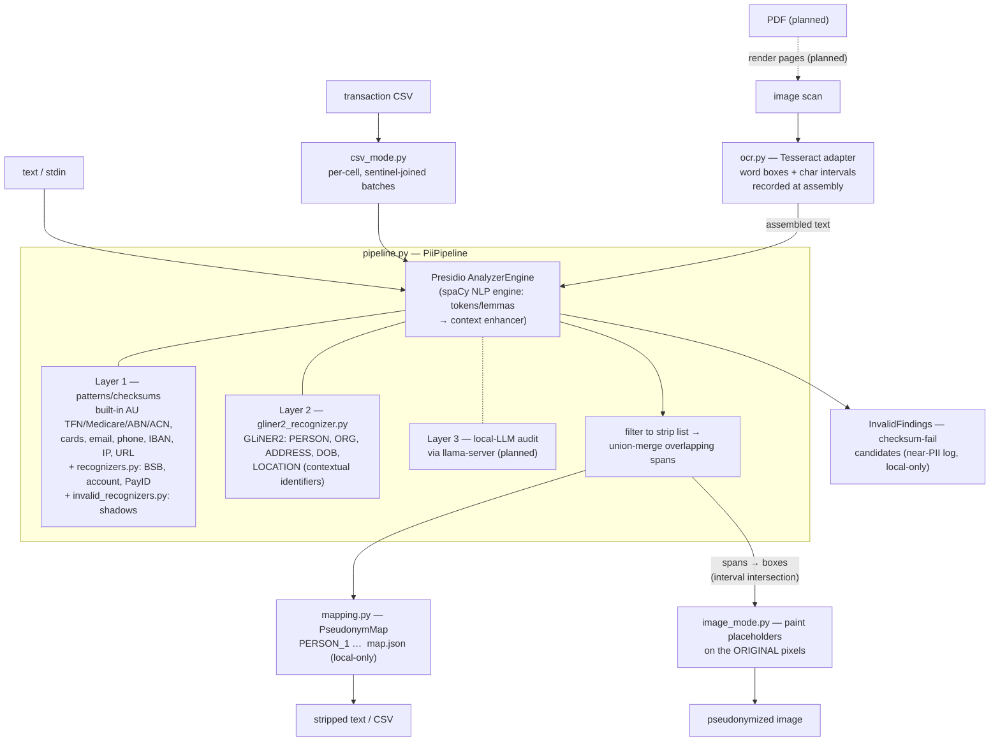

# PII Tool — Architecture & Design Decisions

Living document for the Phase 1 PII-stripping tool, split out of the root
[../ARCHITECTURE.md](../ARCHITECTURE.md) on 2026-07-14. Every non-obvious architecture or
design decision lands here with its rationale and date, so future changes argue against the
*reason*, not just the code. The activity overview is in [ROADMAP.md](ROADMAP.md), open tasks
in [TODO.md](TODO.md), completed-task engineering records in [DONE.md](DONE.md), usage in
[README.md](README.md).

## System overview

Goal: strip personally identifiable information from documents **locally** so the stripped
version can be shared with cloud models — the inputs are classified and nothing leaves the
machine. Output is **pseudonymized, not redacted**: stable placeholders (`PERSON_1`) with a
rehydratable local mapping. Standalone from the RAG app — nothing here imports `rag_tools`
or the web app; the only planned shared infrastructure is the local llama-server.

### Third-party modules and their roles

| Module | Role |
|---|---|
| `presidio-analyzer` ≥ 2.2.363 | The orchestrator and layer 1: recognizer registry, pattern/checksum recognizers (including the built-in AU ones), scoring, and the lemma-based context enhancer. **Not** `presidio-image-redactor` — see the orthogonality decision below. |
| spaCy (`en_core_web_sm`) | Presidio's mandatory **NLP engine** — tokenization and lemmas that feed the context enhancer. Not a detector: `SpacyRecognizer` was retired 2026-07-15 (decision below); spaCy stays loaded solely for the NLP engine. |
| GLiNER2 (`fastino/gliner2-privacy-filter-PII-multi`, ~1.2 GB) | Layer-2 zero-shot NER — names, addresses, DOB, person-vs-organization. Wrapped as an ordinary Presidio recognizer. |
| Tesseract 5.x + `pytesseract` | The OCR engine behind the image path — first of the planned interchangeable backends. |
| Pillow | Pixel painting for image output. |

### Our modules

| Module | Role |
|---|---|
| `cli.py`, `__main__.py` | `strip` / `analyze` / `rehydrate` commands and all flags |
| `pipeline.py` | `PiiPipeline` — builds the Presidio registry (all three layers), runs one analyzer pass, filters to the strip list, union-merges overlaps, collects checksum-invalid findings |
| `recognizers.py` | Custom AU pattern recognizers: BSB, bank account (context-boosted), PayID |
| `invalid_recognizers.py` | Shadow recognizers with inverted validation — collect checksum-fail candidates (`*_INVALID` / `*_MALFORMED`) |
| `gliner2_recognizer.py` | GLiNER2 as a Presidio recognizer; **all layer-2 tuning lives in its docstring** — read it before touching NER behaviour |
| `mapping.py` | `PseudonymMap` — placeholder allocation, JSON persistence, rehydration |
| `csv_mode.py` | Per-cell transaction-CSV processing |
| `ocr.py` | OCR-engine adapter: word boxes → assembled text with char intervals recorded at assembly time |
| `image_mode.py` | Image front/back-end: OCR text through the unchanged text pipeline, placeholders painted onto the original pixels |

### The whole picture

## Pipelines

### Text — the core; every other mode wraps it

One Presidio analyzer pass over the input produces raw detections from all registered
recognizers. `PiiPipeline` then: (1) filters to strip-listed entity types, (2) union-merges
overlapping spans, (3) allocates placeholders in document order from the `PseudonymMap` and
splices them in right-to-left so offsets stay valid. The same pass also yields the
checksum-invalid findings (collected, deduplicated, optionally masked). `rehydrate` is the
inverse: placeholders in a cloud answer are replaced with the first-seen surface forms from
the mapping.

### CSV — per-cell wrapper

Cells of a column are batched into one analyzer call, joined by a sentinel (`␞`) no
recognizer can match across, with a hard alignment check afterwards; NER spans are clamped
per cell. Placeholders can never straddle cell boundaries; date/amount columns pass through
byte-identical. See the CSV decision below.

### Image — a front-end and back-end around the unchanged text pipeline

Front-end (`ocr.py`): OCR the image into word boxes, drop empty boxes, assemble the text,
recording `(char_start, char_end, bbox)` per word *at assembly time*. The assembled text goes
through the full text pipeline verbatim — detection never sees pixels. Back-end
(`image_mode.py`): mapping merged spans to boxes is pure interval intersection over the
recorded intervals; each span's placeholder is painted over its boxes on the **original**
image (background-filled box with the placeholder text drawn in — pseudonymization, not
blackout), emitting the same rehydratable `map.json`.

### PDF — planned

Render pages → image pipeline per page → reassemble the PDF from the painted pixels
(rationale in the "PDFs as rendered images" decision below).

## Detection stack

Three layers, unioned — no single detector catches everything (2026-07-05):

| Layer | Engine | Owns | Status |
|---|---|---|---|
| 1 | Presidio patterns + checksums | TFN, Medicare, ABN/ACN, BSB, account, PayID, cards, email, phone, IBAN, IP, URL; invalid-candidate shadows | shipped |
| 2 | GLiNER2 zero-shot NER | PERSON, ORGANIZATION, ADDRESS, DATE_OF_BIRTH, LOCATION (bare place names as contextual identifiers) (+ unvalidated guesses of layer-1 types) | shipped |
| 3 | Local LLM audit (llama-server) | contextual identifiers ("the borrower's wife, a dentist in Wagga Wagga") | planned |

One pipeline (the `--no-ner` patterns-only regime was retired 2026-07-15, decision below):
GLiNER2 always loads and owns PERSON/ORG/ADDRESS/DOB and LOCATION; `SpacyRecognizer` is
removed from the registry, and spaCy serves only as Presidio's NLP engine. Slower than a
pattern-only pass (model load + CUDA inference), full recall.

### Do we still need Presidio and spaCy when NER does the heavy lifting? Yes.

- **Checksum validation is Presidio's, not ours.** The AU TFN/Medicare/ABN/ACN validators and
  Luhn are Presidio's own code (verified working); our custom recognizers add BSB, account
  numbers and PayID, and our shadow recognizers invert those validators for the
  invalid-identifier feature. GLiNER2 emits *unvalidated guesses* of these types — layer 1 is
  what makes them trustworthy.
- **The context enhancer needs the NLP engine.** Presidio's lemma-based context boost powers
  the account-number recognizer and the `context` invalid-collection tier; it consumes
  spaCy's tokens/lemmas, so spaCy stays loaded even if every spaCy detector is removed.
- **Presidio is the chassis.** The registry, scoring, and result model are what all three
  layers (and the CSV/image wrappers) plug into; our pipeline-level value-add (recall-first
  merging, invalid findings, pseudonym planning) sits on top of it.
- **spaCy is the NLP engine, not a detector (since 2026-07-15).** The lemma-based context
  enhancer consumes spaCy's tokens/lemmas, so spaCy stays loaded — but `SpacyRecognizer` is
  removed: GLiNER2's location label now owns the bare-city-name contextual identifiers spaCy's
  LOCATION detector used to (retirement decision below). The layer-3 audit may later let even
  the GLiNER2 location pass be dropped (TODO.md).

## Design decisions

### Pseudonymization over redaction (2026-07-05)

PII is replaced with stable placeholders (`John Smith → PERSON_1` everywhere, across a whole
document set), not blanks. Rationale: the cloud model can still reason about "PERSON_1's
recurring rent payments", and its answers are **rehydratable** — a local reverse pass restores
the real values. The mapping store (JSON) contains the original PII: it is gitignored and must
never leave the machine.

- Placeholders are allocated in document order (readable mappings) and matched
  case-insensitively with whitespace collapsed; rehydration restores the first-seen surface
  form.

### Presidio AU recognizers require explicit registration (2026-07-12)

Presidio *ships* AU_TFN/AU_MEDICARE/AU_ABN/AU_ACN implementations (open source, MIT — no paid
tier involved), but its default registry config
(`presidio_analyzer/conf/default_recognizers.yaml`) lists every country-specific recognizer
with `enabled: false`; only generic + US recognizers are on by default. Consequence: they
silently never run unless registered. `pii/pipeline.py` registers the four AU classes
explicitly. The checksum logic is ordinary local Python in the library
(`predefined_recognizers/country_specific/australia/`) and verified working: a valid-checksum
TFN scores 1.00, a digit-swapped one is rejected entirely. Keep presidio ≥ 2.2.363 —
2.2.362's ACN validator rejects every ACN with check digit 0.

### Recall-first span handling (2026-07-12 — two leak classes found and designed out)

Scoring philosophy: a false positive costs some analytical utility; a false negative leaks
classified PII. Every ambiguity resolves toward stripping.

- **Filter before overlap resolution.** Detected spans are filtered to strip-listed entity
  types *before* overlaps are resolved. Found the hard way: spacy emits bogus high-score
  `DATE_TIME` spans over account/phone numbers; if kept-type spans compete, they shadow real
  PII which then leaks.
- **Merge overlapping PII spans; never rank them.** Highest-score-wins let a small `AU_BSB`
  span (0.55) evict a wider account-number span (0.52) that covered it, exposing the
  remainder. Overlapping strip-listed spans are unioned into one replacement (entity type of
  the highest-scored member; invalid classes rank below any valid type). The general merging
  algorithm (weight combination, disagreeing classes, kept-type nesting) is still to be
  defined — see the overlaps task in TODO.md.

### NER backend: GLiNER v1 → GLiNER2 (2026-07-12; v1 removed 2026-07-13)

The original backend (`urchade/gliner_multi_pii-v1`) had two empirical quirks found on the
synthetic sample — ALL-CAPS text tanked recall, and entities found reliably in a short line
were missed when the same line sat inside a full document — worked around with multi-pass
prediction (document windows + individual lines, each also de-capitalized, unioned).

GLiNER2 (Fastino, Apache 2.0, PII-tuned model with schema descriptions) has neither weakness,
matched v1 on Tier-1 PERSON (100%) and ran ~4.7× faster, so it became the sole backend; the
v1 recognizer and its `--ner-backend` switch were removed (recoverable from git history, last
commit with v1: 46212eb). GLiNER2's own quirks and tuning live in
`pii/gliner2_recognizer.py`'s docstring — windowing for memory, re-finding of repeated
mentions, separate schema passes for addresses, honorific extension. Accepted cost either
way: some over-stripping (e.g. a merchant line labeled as an address) — a precision-tuning
item, not a leak.

### GLiNER2 span width: default max_width=12 (2026-07-14)

GLiNER2 enumerates candidate spans of 1..max_width words; the trained default of 8 was the
root cause of multi-part AU address fragmentation (the only entity class wider than 8 words).
max_width is an inference-time parameter, not baked into weights, and the scorer generalizes
past its training width — lifting it to 12 flipped all four fragmented one-line addresses to
fully stripped on Tier-1, with no other class changed and negligible latency. 16 showed the
first wide-span false-positive creep, so 12 it is; note the model's word tokenizer counts a
comma as a word, so nominal word counts need ~+1 margin. Label competition inside a schema
(count-based decoding — confirmed reading gliner2-rs) is why addresses get dedicated passes;
those workarounds are kept regardless of width. Full experiment records and the gliner2-rs
harvest are in DONE.md; per-class widths and schema partitioning are open experiments in
TODO.md.

### spaCy detector retired; GLiNER2 owns LOCATION (2026-07-15)

`SpacyRecognizer` is gone from the registry, and the `--no-ner` patterns-only regime with it;
spaCy remains solely as Presidio's mandatory NLP engine (tokens/lemmas → context enhancer).
GLiNER2's location pass — now unconditional (it shipped behind a `location=True` ablation
flag, retired later the same day: trivially re-introduced if an ablation is ever wanted) —
is the production contextual-identifier net. Supersedes the two 2026-07-14 decisions
(spaCy-restricted-to-LOCATION and the location-label experiment).

History and rationale:

- **spaCy's detector emissions hurt.** On OCR text en_core_web_sm produced cross-line glue
  PERSON spans ('Emily Watson\nAddress') and date-as-PERSON false positives, while GLiNER2
  already owned PERSON/ORG/dates cleanly. From 2026-07-14 it was first restricted to LOCATION —
  its one non-redundant role — before being dropped entirely here.
- **GLiNER2's location label strictly dominates spaCy LOCATION.** A dedicated single-label
  LOCATION schema pass, isolated from the main labels (label competition, same as the address
  passes), with two precision guards: an exclusionary description and a `LOCATION_MIN_CHARS=4`
  floor (the raw FPs were all short codes/acronyms — 'AU', 'NSW', 'NAB'; trade-off: genuine
  3-letter suburbs like Kew/Ayr are sacrificed, acceptable for a net the layer-3 audit is meant
  to own). Tier-1 head-to-head (seed 123, 30 docs; record in DONE.md): spaCy caught 6/11
  contextual-ID towns (blind to 'Wagga Wagga'/'Dubbo'), the GLiNER2 label 11/11, with
  ORGANIZATION over-strips unchanged at baseline (33) and one fewer ADDRESS leak; PERSON
  identical (170/172). The 2026-07-15 ship verification on seeds 42 and 123 reproduced these
  numbers (the remaining critical misses are the pre-existing joint-name GLiNER2 gap —
  PERSON_JOINT/PERSON_REVERSED — unchanged by this work, pending layer 3).
- **Scope.** The patterns-only regime is removed outright (Sergei, 2026-07-15): its name leaks
  made it unsafe for names/addresses, and every input mode now runs the one pipeline. The
  ORG-absorbs-contained-location merge rule stays out of scope (overlaps task, TODO.md) — the
  location pass reaches org-over-strip parity without it.

Registry composition is regression-tested in `tests/pii/test_registry_policy.py` (SpacyRecognizer
absent, Gliner2Recognizer present and owning LOCATION, via a model-free GLiNER2 shim; two
model-marked tests check the real-stack nuances).

### Min-length floors on GLiNER2 guesses — where they apply and where they must not (2026-07-14)

Same-day siblings of the location floor, from the "short strings shouldn't qualify" discussion:
- **AU_BANK_ACCOUNT: always-on digit floor** (`AU_BANK_ACCOUNT_MIN_DIGITS=5`, matching layer-1's
  `\d{5,10}`) — kills fragment guesses ('42') at zero recall cost. Digits, not characters:
  GLiNER2 emits space-grouped accounts ('0007 3111 4') as one span, and separators must not
  push a real account under the floor (regression-tested in `tests/pii/test_gliner2_floors.py`).
  Layer-1's `AuAccountNumberRecognizer.validate_result` applies the same >=5-digit rule.
- **PERSON and ORGANIZATION: no floor, deliberately** (confirmed with Sergei) — real 2-char
  surnames (Wu, Ng) make a PERSON floor a leak risk on a CRITICAL type; real 3-char orgs
  (NAB, ANZ, BHP) make an ORG floor wrong. The measured short FPs cluster on numeric-ID
  types instead; the general policy for those guesses is an open TODO item.

### Mechanical joint-name forms are layer-1 patterns, not an NER problem (2026-07-15)

`JointNameRecognizer` (pii/recognizers.py, emits PERSON) owns the joint-account name
shapes: initials-pair 'E & J Moore' (@0.5) and shared-surname 'Julie and Brian Summers' /
'JULIE AND BRIAN SUMMERS' (@0.45). Rationale from the raw-emission diagnostic (DONE.md):
GLiNER2 labels these forms confidently (0.93+) in clean context but loses *span
segmentation* when adjacent ref-codes/keywords crowd them in transaction lines — glue
spans, dropped initials, split pairs. The very regularity that breaks the NER makes the
forms pattern-matchable, so the fix belongs in layer 1, not in schema/description tuning.

Two design points:

- **Confident scores, no context gating.** Presidio's context enhancer looks 5 tokens
  back and 0 forward; on statement lines the joint name routinely trails a payee/ref tail
  longer than that. Context-promoted sub-threshold patterns (the account-number idiom)
  would systematically miss exactly the lines the recognizer exists for.
- **Precision guard is a stop-vocabulary, not a floor.** 'X AND Y Z' caps triples collide
  with statement phrases ('PRINCIPAL AND INTEREST PAYMENT') and org names ('ANGUS AND
  ROBERTSON PTY'); `validate_result` rejects matches containing statement/corporate
  vocabulary. Accepted trade-offs, recall-first: surnames that collide with that
  vocabulary are sacrificed, and 'X AND Y Z' orgs without a corporate tail strip — the
  eval's ORGANIZATION over-strip axis watches for creep (unmoved at ship time).

With this, `PERSON_JOINT` moved into the eval's CRITICAL gate (100% on seeds 42/123).
`PERSON_REVERSED` ('MOORE OLGA') stays a per-form probe: two bare caps words admit no
pattern, so the reversed-caps residual keeps its own TODO item.

### What is deliberately kept (2026-07-12)

`ORGANIZATION` (merchant names — the analytical substance of spending data) and `DATE_TIME`
(transaction dates) are detected but not stripped by default; `DATE_OF_BIRTH` is stripped.
Overrides: `--strip-orgs` now; full per-run entity-type selection is a planned feature
(TODO.md).

### Checksum-invalid identifiers are surfaced, not silently dropped (2026-07-14)

A value shaped like a TFN whose mod-11 arithmetic fails is a typo, bad OCR, or forgery — all
three worth reporting. Design: *shadow recognizers* (`invalid_recognizers.py`) mirror the
checksummed recognizers with inverted validation, emitting distinct classes per failure mode —
`*_INVALID` (checksum fails) vs `*_MALFORMED` (structurally impossible) — because the
typo-vs-impossible distinction is exactly the forgery signal. Three orthogonal CLI controls
(collection tier / log / mask); collection tiers are defined by *where the evidence sits*
(in-span grouping or label → `likely`; nearby context words via the lemma enhancer →
`context`; any failing match → `all`, which is noise). Guardrails: candidates covered by a
*validated* detection are suppressed (keyed on the validating recognizer's name, not entity
type — an NER guess must never suppress); invalid classes always lose the placeholder to
valid types on overlap. Adopted defaults: `likely` + log + no mask. **The findings log is
near-PII** (a typo'd TFN is a real TFN minus a digit) — local-only artifact, like `map.json`.
Full design narrative, eval numbers and follow-on findings: DONE.md.

### CSV handling (2026-07-12)

Bank transaction lists are processed **per cell**, optionally restricted to named columns:
placeholders can never straddle cell boundaries, and date/amount columns pass through
byte-identical. Cells of a column are batched into one analyzer call, joined by a sentinel
(`␞`) no recognizer can match across, with a hard alignment check afterwards. Side benefit
observed: cell-level context avoids some of the over-stripping seen in whole-text mode.

### PDFs will be processed as rendered images (decided 2026-07-05, not yet built)

Financial-sector PDFs often carry junk/broken text layers (confirmed: one reference statement
has one), and rebuilding output from pixels eliminates the hidden-text-layer leak class
entirely. Corollary requirement from the reference docs: mailing barcodes (Australia Post
4-state) encode the delivery address and are invisible to text-based detection — the image
pass must detect and mask barcode regions.

### Image path is orthogonal to presidio-image-redactor (2026-07-14)

The OCR/image pipeline is built around our own `PiiPipeline`, not Microsoft's
`presidio-image-redactor` package. Presidio stays exactly where it is today — as the engine
inside the *text-analysis* layer — and the image path is a front-end (render → OCR → assembled
text with offset↔word-box bookkeeping) plus a back-end (span → boxes → paint → reassemble PDF)
around the unchanged text pipeline. Reasons:

- **Wrong hook point.** `ImageAnalyzerEngine` plugs in at the bare `AnalyzerEngine` level, but
  our value-add lives above it in `pii/pipeline.py`: recall-first union overlap merging (theirs
  drops overlaps by score rank — the leaky approach rejected 2026-07-12), invalid-identifier
  collection/reporting, strip planning, pseudonym mapping. Adopting it means bypassing or
  forking all of that.
- **Wrong output model.** `ImageRedactorEngine` draws filled boxes — blank redaction. Our core
  requirement is pseudonymization: paint the region and draw the placeholder (`PERSON_1`) into
  it, emitting the same rehydratable `map.json`.
- **No home for roadmap items.** Barcode masking is not text-driven (no OCR span to map);
  the OCR bake-off needs an engine interface we own (theirs is shaped like Tesseract's TSV, so
  wiring PaddleOCR/Surya is the same work either way); a future local-VLM path does OCR+detection
  in one pass, which an OCR-then-analyze frame can't express; PDF reassembly and the
  belt-and-braces text-layer scan are ours to build regardless.
- **The eval needs to own the mapping.** pii_eval's planned degradation tier and the Tier-3
  cross-OCR-engine disagreement metric both require control over the assembled-text/offset/box
  contract — that must not be buried in a third-party engine.

The 2026-07-14 source review (full harvest in DONE.md) confirmed the decision and demoted
their span→bbox mapping to a *what-to-avoid* exhibit — it re-derives char offsets in its
matching loop and carries two silent-leak classes. What did transfer into our design:

- **Record `(char_start, char_end, bbox)` per word at assembly time** so span→boxes is pure
  interval intersection over *merged* spans (never raw analyzer results — merge-before-paint
  eliminates their overlapping-results leak by construction).
- **The OCR interchange format**: Tesseract's `image_to_data` parallel-lists dict as the
  engine-neutral contract — the seam for the Tesseract/PaddleOCR/Surya bake-off (any engine
  normalizes into it; drop empty word boxes before assembly).
- **Coordinate discipline**: any OCR preprocessing feeds OCR *only*; painting happens on the
  original pixels, with explicit scale/offset metadata mapping boxes back.
- **Allow-listing belongs in the text layer only** — their per-word allow-list recheck at
  paint time is a leak vector; the paint layer must follow merged spans exactly.
- Smaller notes: Tesseract misreads text flush against image edges (pad tightly-cropped
  inputs); a per-document deny-list of known-by-construction values (account-holder name,
  account number) is a cheap recall booster; image-tier eval should match boxes with pixel
  tolerance, never exact coordinates.

`presidio-image-redactor` is not installed as a dependency; only `presidio-analyzer` remains.

### OCR backends are interchangeable adapters; a local VLM is not (2026-07-14)

The engine seam is the word-box interchange dict in `ocr.py`. Tesseract is the first adapter;
PaddleOCR/Surya/docTR are future adapters normalizing into the same contract (polygons →
axis-aligned envelopes), so the text pipeline and the paint layer never know which engine ran.
The exception is a local VLM (Qwen-VL class) doing OCR+PII detection in one pass: that cannot
be expressed as an OCR adapter feeding the analyze step — if pursued, it becomes an
*alternative pipeline* whose output joins at the merged-spans level. Bake-off task in TODO.md.

### Layer-3 LLM audit (contingent — expectation set 2026-07-15)

**Layer 3 is not a certainty.** The plan is to evaluate the tool end-to-end with layers 1+2
only; layer 3 gets built only if those results prove unsatisfactory (Sergei, 2026-07-15).
Consequence: known layer-1/2 gaps must not be parked as "layer 3 will own it" — each needs
its own fix or an explicit accepted-loss record (the joint/reversed person-name gap got its
own TODO item the same day; the joint half was then fixed at layer 1 — see the joint-name
decision above — leaving the reversed-caps residual as the open item).

The design, should it be built: a local-LLM pass over the layer-1/2-stripped text — "does
this still contain anything identifying?" — served by llama-server (the one piece of
infrastructure shared with the RAG app). It joins the stack *before* overlap merging
conceptually: its findings become spans like any other layer's, so the CSV and image wrappers
inherit it for free. It targets what layers 1–2 cannot see by nature: contextual identifiers.
Its arrival would trigger one recorded revisit (TODO.md): consider dropping the GLiNER2
location pass.

### Evaluation (designed 2026-07-05/12; text tier built 2026-07-12)

Three tiers, because real documents are classified until stripped: (1) synthetic corpus with
ground truth by construction; (2) PII-transplanted real layouts; (3) metrics-only runs on the
real corpus. Acceptance is recall-first and severity-weighted: zero critical misses (TFN,
account numbers, names), not an F1 number. Tier plan in [ROADMAP.md](ROADMAP.md); harness in
[../pii_eval/](../pii_eval/README.md); text-tier record in DONE.md.

### spaCy source review — the measured failure modes, grounded in mechanism (2026-07-15)

The 2026-07-14/15 eval findings against SpacyRecognizer now have source-level explanations
(review record with the full harvest in [DONE.md](DONE.md)); they underpin the detector
retirement independently of the eval numbers:

- **Glue spans are structural, not incidental.** en_core_web_sm's transition system forbids
  entities *starting* on whitespace but not *containing* it, and its sentence bounds come
  from a parser that finds none in punctuation-less OCR lines — so nothing stops a PERSON
  from swallowing a `name\naddress\ntown` block, and greedy decoding commits the error at
  the first token. No threshold or post-filter fixes a constraint that isn't there.
- **AU-place blindness is representational.** OntoNotes-trained, no gazetteer, no static
  vectors: an OOV town is just a hashed NORM + 1-char prefix + 3-char suffix + SHAPE inside
  a ±4-token receptive field — `Wagga` is feature-identical to a surname. The model
  self-reports LOC f=0.668 / FAC f=0.349 even in-domain.
- **Tokenization gates Presidio's context enhancer.** `/` and `:` infixes split only before
  letters, so `a/c` fragments (`a|/|c`) while `TFN:123456782` / `ph:0412345678` stay single
  tokens — either way the label word never surfaces as a token for lemma-context matching,
  and the rule lemmatizer's PROPN passthrough leaves HEADER-CASE label words unlemmatized
  on top. Char-level regex label matching (our layer 1) is the right instrument on this
  text; keep label/context matching char-level.

Input for the overlaps-merging task: spaCy's `util.filter_spans` (longest-first greedy,
earliest-start tiebreak, winner-take-all) is the standard precision-first alternative to our
recall-first union merge; spaCy itself keeps overlapping candidates in `SpanGroup`s and
resolves late, and SpanRuler exposes the rule-vs-model conflict policy as a pluggable
filter — useful framing when we define our merge algebra.

## Dependency/runtime notes

- `pii/` keeps its own `requirements.txt`; repo-wide `pyproject.toml` + uv is a Phase 2 item
  (root ROADMAP).
- presidio ≥ 2.2.363 (see the AU-recognizers decision above).
- CUDA torch installed 2026-07-12 for the RTX 2080 Ti — CPU-only NER cost ~1 min/page; with
  CUDA the NER share of an eval run is ~0.7 s.
- GLiNER2 weights download once into `models/hf-cache/` (gitignored).
- spaCy model: `python -m spacy download en_core_web_sm`.
- Tesseract 5.4.0 installed system-wide (winget, UB Mannheim build) + `pytesseract`.
