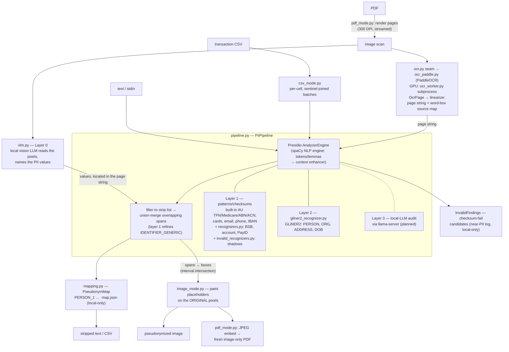

# PII Engine (core) — Architecture & Design Decisions

Living document for the **core PII engine** — the detection/pseudonymization pipeline in
`pii/core/`, independent of any front-end. Split out of the root
[../../ARCHITECTURE.md](../../ARCHITECTURE.md) on 2026-07-14 and moved under `pii/core/` in
the 2026-07-16 component split (component map and dependency rules: the umbrella
[../ARCHITECTURE.md](../ARCHITECTURE.md); the CLI front-end:
[../cli/ARCHITECTURE.md](../cli/ARCHITECTURE.md); the planned GUI: [../gui/](../gui/)). Every
non-obvious architecture or design decision lands here with its rationale and date, so future
changes argue against the *reason*, not just the code. Engine activity overview is in
[ROADMAP.md](ROADMAP.md), open tasks in [TODO.md](TODO.md), completed-task engineering records
in [DONE.md](DONE.md), usage in [../README.md](../README.md).

## System overview

Goal: strip personally identifiable information from documents **locally** so the stripped
version can be shared with cloud models — the inputs are classified and nothing leaves the
machine. Output is **pseudonymized, not redacted**: stable placeholders (`PERSON_1`) with a
rehydratable local mapping. Standalone from the RAG app — nothing here imports `rag_tools`
or the web app; the only planned shared infrastructure is the local llama-server.

### Third-party modules and their roles

| Module | Role |
|---|---|
| `presidio-analyzer` ≥ 2.2.364 | The orchestrator and layer 1: recognizer registry, pattern/checksum recognizers (including the built-in AU ones), scoring, and the lemma-based context enhancer. **Not** `presidio-image-redactor` — see the orthogonality decision below. |
| spaCy (`en_core_web_sm`) | Presidio's mandatory **NLP engine** — tokenization and lemmas that feed the context enhancer. Not a detector: `SpacyRecognizer` was retired 2026-07-15 (decision below); spaCy stays loaded solely for the NLP engine. |
| GLiNER2 (`fastino/gliner2-privacy-filter-PII-multi`, ~1.2 GB) | Layer-2 zero-shot NER — names, addresses, DOB, person-vs-organization. Wrapped as an ordinary Presidio recognizer. |
| PaddleOCR (`paddleocr` + a `paddlepaddle` wheel) | The OCR engine behind the image path (Tesseract was the first backend, retired 2026-07-17 — decision below). GPU wheel runs in a worker subprocess (torch coexistence). |
| Pillow | Pixel painting for image output. |

### Our modules

All modules below live in `pii/core/`. The front-ends are separate components: the
`strip`/`analyze`/`rehydrate` CLI is `pii/cli/` ([../cli/ARCHITECTURE.md](../cli/ARCHITECTURE.md)),
the planned GUI is `pii/gui/` — both build on this package and never import each other.

| Module | Role |
|---|---|
| `__init__.py`, `constants.py` | Public API surface (`PiiPipeline`, `PseudonymMap`, `RECORD_SEPARATOR`, `DEFAULT_STRIP_ENTITIES`, `InvalidFinding`, `INVALID_ENTITY_TYPES`); `RECORD_SEPARATOR` lives in `constants.py` (zero-import, cycle-free) |
| `pipeline.py` | `PiiPipeline` — builds the Presidio registry (all three layers), runs one analyzer pass, filters to the strip list, union-merges overlaps, collects checksum-invalid findings |
| `recognizers.py` | Custom AU pattern recognizers: BSB, bank account (context-boosted), PayID |
| `invalid_recognizers.py` | Shadow recognizers with inverted validation — collect checksum-fail candidates (`*_INVALID` / `*_MALFORMED`) |
| `gliner2_recognizer.py` | GLiNER2 as a Presidio recognizer; **all layer-2 tuning lives in its docstring** — read it before touching NER behaviour |
| `mapping.py` | `PseudonymMap` — placeholder allocation, JSON persistence, rehydration |
| `csv_mode.py` | Per-cell transaction-CSV processing |
| `vlm.py` | **Layer 0** — a local vision LLM reads the page image and names the PII; transport, prompt, parsing, `locate()` |
| `ocr.py` | OCR-engine seam (`get_ocr_page`) + the shared pixel toolkit (`Box`, `_rows` banding, word-box normalization) |
| `ocr_page.py` | Perception: `OcrPage` → `OcrLine` → `OcrWord` + `OcrFrame`. Geometry only, no character offsets |
| `linearization.py` | `OcrPage` → `RecognizerInput`: the flat page string plus the source map that turns a span back into pixel boxes |
| `ocr_paddle.py` | PaddleOCR adapter: line-oriented det/rec → per-word `OcrPage`; picks worker vs in-process by wheel |
| `ocr_worker.py` | Persistent PaddleOCR worker subprocess (GPU paddle can't share a process with torch) — framed PNG-in / `OcrPage`-out |
| `ocr_debug.py` | `pii debug ocr` renderers over an `OcrPage`: JSON, text summary, annotated overlay |
| `paint.py` | The drawing toolkit (`Segment`, `paint_segments`, fill/frame styles), shared by strip and the debug overlay |
| `image_mode.py` | Image front/back-end: detect (layer 0 or the layers path), locate in the OCR text, paint placeholders onto the original pixels |
| `pdf_mode.py` | PDF render + reassembly legs: pages → pixels → image pipeline per page → fresh image-only PDF (`pdf_to_images`, `strip_pdf`) |

### The whole picture

## Pipelines

### Text — the core; every other mode wraps it

One Presidio analyzer pass over the input produces raw detections from all registered
recognizers. `PiiPipeline` then: (1) filters to strip-listed entity types, (2) union-merges
overlapping spans, (3) allocates placeholders in document order from the `PseudonymMap` and
splices them in right-to-left so offsets stay valid. The same pass also yields the
checksum-invalid findings (collected, deduplicated, optionally masked). `rehydrate` is the
inverse: placeholders in a cloud answer are replaced with the first-seen surface forms from
the mapping.

### CSV — per-cell wrapper

Cells of a column are batched into one analyzer call, joined by a sentinel (`␞`) no
recognizer can match across, with a hard alignment check afterwards; NER spans are clamped
per cell. Placeholders can never straddle cell boundaries; date/amount columns pass through
byte-identical. See the CSV decision below.

### Image — detect, locate, paint

Front-end: OCR the page into an `OcrPage` and `linearize` it into the flat page string plus a
source map recording `(char_start, char_end, bbox)` per word *as it is written*. Detection is
layer 0 by default — the model reads the pixels and names the values, each of which is located
in that string — or, with `--detector layers`, the full text pipeline run on the string
verbatim. Either way layer 1 supplies the precise classes, the checksum shadows and a recall
floor. Back-end (`image_mode.py`): mapping merged spans to boxes is pure interval intersection
over the recorded intervals; each span's placeholder is painted over its boxes on the
**original** image (background-filled box with the placeholder text drawn in —
pseudonymization, not blackout), emitting the same rehydratable `map.json`.

### PDF — the image pipeline per page, reassembled from scratch

`strip_pdf` (`pdf_mode.py`, 2026-07-18) streams pages through the image pipeline — render at
300 DPI (default) → OCR → text pipeline → paint — and embeds each painted page into a
**fresh** pymupdf document at the source page's physical size in points. Nothing is copied
from the source document object, so text layers, annotations, attachments and metadata are
absent by construction (the metadata dict is explicitly emptied on top); the hidden-text-leak
class cannot survive. One pipeline instance, one OCR engine and one shared `PseudonymMap`
serve all pages: memory stays flat (a 300 DPI A4 page is ~26 MB of pixels) and placeholders
are consistent across the document. Processing is lossless end-to-end; only the final embed
is lossy — JPEG q90 (decision 2026-07-18; the eval scorer re-OCRs output pixels, so encoding
damage is measured, not hidden; configurability is a recorded TODO). Rationale for
pixels-first is in the "PDFs as rendered images" decision below.

## Detection stack

Three layers, unioned — no single detector catches everything (2026-07-05):

| Layer | Engine | Owns | Status |
|---|---|---|---|
| 0 | Local VLM reading the page image (`vlm.py`) | everything, from pixels — an *alternative* to 1+2 on the image/PDF paths, not an addition to them | shipped 2026-08-08, opt-in (`--detector vlm`) |
| 1 | Presidio patterns + checksums | TFN, Medicare, ABN/ACN, BSB, account, PayID, cards, email, phone, IBAN; invalid-candidate shadows | shipped |
| 2 | GLiNER2 zero-shot NER | PERSON, ORGANIZATION, ADDRESS, DATE_OF_BIRTH (+ unvalidated guesses of layer-1 types) | shipped |
| 3 | Local LLM audit (llama-server) | contextual identifiers ("the borrower's wife, a dentist in Wagga Wagga") | planned |

Layer 0 *replaces* 1+2 rather than joining the union: it is selected instead of them, so the
"three layers, unioned" statement above describes the default `--detector layers` path.
Combining them — layer 1 refining and validating layer 0's findings — is designed and not yet
built (TODO.md).

One pipeline (the `--no-ner` patterns-only regime was retired 2026-07-15, decision below):
GLiNER2 always loads and owns PERSON/ORG/ADDRESS/DOB; `SpacyRecognizer` is removed from the
registry, and spaCy serves only as Presidio's NLP engine. Slower than a pattern-only pass
(model load + CUDA inference), full recall. Standalone `LOCATION` detection was retired
2026-07-23 (decision below) — bare place names now pass verbatim.

### Do we still need Presidio and spaCy when NER does the heavy lifting? Yes.

- **Checksum validation is Presidio's, not ours.** The AU TFN/Medicare/ABN/ACN validators and
  Luhn are Presidio's own code (verified working); our custom recognizers add BSB, account
  numbers and PayID, and our shadow recognizers invert those validators for the
  invalid-identifier feature. GLiNER2 emits *unvalidated guesses* of these types — layer 1 is
  what makes them trustworthy. The shadows *re-implement* rather than call that arithmetic
  (`pii/core/checksums.py`), so each copy must track Presidio exactly: a valid/invalid pair
  partitions its digit space, and any disagreement drops values through both sides
  unreported. Presidio 2.2.364's ABN change proved the risk — see [DONE.md](DONE.md).
- **The context enhancer needs the NLP engine.** Presidio's lemma-based context boost powers
  the account-number recognizer and the `context` invalid-collection tier; it consumes
  spaCy's tokens/lemmas, so spaCy stays loaded even if every spaCy detector is removed.
- **Presidio is the chassis.** The registry, scoring, and result model are what all three
  layers (and the CSV/image wrappers) plug into; our pipeline-level value-add (recall-first
  merging, invalid findings, pseudonym planning) sits on top of it.
- **spaCy is the NLP engine, not a detector (since 2026-07-15).** The lemma-based context
  enhancer consumes spaCy's tokens/lemmas, so spaCy stays loaded — but `SpacyRecognizer` is
  removed (decision below). Contextual identifiers, including bare place names, are deferred
  to the planned layer-3 audit.

## Design decisions

### Pseudonymization over redaction (2026-07-05)

PII is replaced with stable placeholders (`John Smith → PERSON_1` everywhere, across a whole
document set), not blanks. Rationale: the cloud model can still reason about "PERSON_1's
recurring rent payments", and its answers are **rehydratable** — a local reverse pass restores
the real values. The mapping store (JSON) contains the original PII: it is gitignored and must
never leave the machine.

- Placeholders are allocated in document order (readable mappings) and matched
  case-insensitively with whitespace collapsed; rehydration restores the first-seen surface
  form.

### Presidio AU recognizers require explicit registration (2026-07-12)

Presidio *ships* AU_TFN/AU_MEDICARE/AU_ABN/AU_ACN implementations (open source, MIT — no paid
tier involved), but its default registry config
(`presidio_analyzer/conf/default_recognizers.yaml`) lists every country-specific recognizer
with `enabled: false`; only generic + US recognizers are on by default. Consequence: they
silently never run unless registered. `pii/core/pipeline.py` registers the four AU classes
explicitly. The checksum logic is ordinary local Python in the library
(`predefined_recognizers/country_specific/australia/`) and verified working: a valid-checksum
TFN scores 1.00, a digit-swapped one is rejected entirely. Keep presidio ≥ 2.2.364 —
2.2.362's ACN validator rejects every ACN with check digit 0, and 2.2.364 changed the ABN
validator's leading-zero handling, which `pii/core/checksums.py` mirrors.

Phone regions are **AU-only** (issue #11 follow-up, Sergei's option A, 2026-07-22; was
AU+US+GB): with US in the list, libphonenumber read account+amount digit runs
('A/C 30-743-3257 1.50' → '3074332571') as valid US numbers and the merged span re-swallowed
the amount the labeled-account guard had just released. Zero measured loss: international
'+'-prefixed numbers are parsed region-independently ('+1 305 555 0123' still strips), AU
13-numbers/1800/mobiles unaffected — the only sacrifice is bare US/GB-domestic-format
numbers, which don't occur on AU statements.

### Recall-first span handling (2026-07-12 — two leak classes found and designed out)

Scoring philosophy: a false positive costs some analytical utility; a false negative leaks
classified PII. Every ambiguity resolves toward stripping.

- **Filter before overlap resolution.** Detected spans are filtered to strip-listed entity
  types *before* overlaps are resolved. Found the hard way: spacy emits bogus high-score
  `DATE_TIME` spans over account/phone numbers; if kept-type spans compete, they shadow real
  PII which then leaks.
- **Merge overlapping PII spans; never rank them.** Highest-score-wins let a small `AU_BSB`
  span (0.55) evict a wider account-number span (0.52) that covered it, exposing the
  remainder. Overlapping strip-listed spans are unioned into one replacement (entity type of
  the highest-scored member; invalid classes rank below any valid type). The general merging
  algorithm (weight combination, disagreeing classes, kept-type nesting) is still to be
  defined — see the overlaps task in TODO.md.

### NER backend: GLiNER v1 → GLiNER2 (2026-07-12; v1 removed 2026-07-13)

The original backend (`urchade/gliner_multi_pii-v1`) had two empirical quirks found on the
synthetic sample — ALL-CAPS text tanked recall, and entities found reliably in a short line
were missed when the same line sat inside a full document — worked around with multi-pass
prediction (document windows + individual lines, each also de-capitalized, unioned).

GLiNER2 (Fastino, Apache 2.0, PII-tuned model with schema descriptions) has neither weakness,
matched v1 on Tier-1 PERSON (100%) and ran ~4.7× faster, so it became the sole backend; the
v1 recognizer and its `--ner-backend` switch were removed (recoverable from git history, last
commit with v1: 46212eb). GLiNER2's own quirks and tuning live in
`pii/core/gliner2_recognizer.py`'s docstring — windowing for memory, re-finding of repeated
mentions, separate schema passes for addresses, honorific extension. Accepted cost either
way: some over-stripping (e.g. a merchant line labeled as an address) — a precision-tuning
item, not a leak.

### GLiNER2 span width: default max_width=12 (2026-07-14)

GLiNER2 enumerates candidate spans of 1..max_width words; the trained default of 8 was the
root cause of multi-part AU address fragmentation (the only entity class wider than 8 words).
max_width is an inference-time parameter, not baked into weights, and the scorer generalizes
past its training width — lifting it to 12 flipped all four fragmented one-line addresses to
fully stripped on Tier-1, with no other class changed and negligible latency. 16 showed the
first wide-span false-positive creep, so 12 it is; note the model's word tokenizer counts a
comma as a word, so nominal word counts need ~+1 margin. Label competition inside a schema
(count-based decoding — confirmed reading gliner2-rs) is why addresses get dedicated passes;
those workarounds are kept regardless of width. Full experiment records and the gliner2-rs
harvest are in DONE.md; per-class widths and schema partitioning are open experiments in
TODO.md.

### spaCy retired as a detector; no standalone place-name detection (2026-07-15; LOCATION reversed 2026-07-23)

Current design: `SpacyRecognizer` is not in the registry and the `--no-ner` patterns-only
regime is gone — spaCy serves only as Presidio's mandatory NLP engine (tokens/lemmas →
context enhancer). GLiNER2 owns PERSON, ORGANIZATION, ADDRESS and DATE_OF_BIRTH. **No
standalone place-name detection runs:** a lone city/town name ('Security property is in
Cairns') passes verbatim — acceptable in mortgage-policy and bank-statement documents, and
not worth a dedicated schema pass' latency or false-positive surface. The ADDRESS passes are
untouched, so full addresses and suburb-state-postcode lines still strip, and a suburb in
clearly address-flavoured context ('resided in Kew') can still be caught by ADDRESS — an
intended residual overlap. Contextual identifiers that are neither addresses nor layer-1
types are deferred to the planned layer-3 audit.

Why spaCy's detector went: on OCR text en_core_web_sm produced cross-line glue PERSON spans
('Emily Watson\nAddress') and date-as-PERSON false positives, while GLiNER2 already owned
PERSON/ORG/dates cleanly (source-level mechanism in the "spaCy source review" decision below).
The `--no-ner` regime was removed outright (Sergei) — its name leaks made it unsafe, and every
input mode now runs the one pipeline.

History: a dedicated GLiNER2 LOCATION pass shipped 2026-07-15 (chosen head-to-head over spaCy
LOCATION, which is blind to towns like 'Wagga Wagga'/'Dubbo') and was retired 2026-07-23 when
the lone-place-name policy above was adopted. The head-to-head numbers, the
`LOCATION_MIN_CHARS=4` floor trade-off, and the retirement are in DONE.md.

Registry composition is regression-tested in `tests/pii/core/test_registry_policy.py`
(SpacyRecognizer absent, Gliner2Recognizer present and not supporting LOCATION; model-free
GLiNER2 shim, plus two model-marked real-stack tests).

### Min-length floors on GLiNER2 guesses — where they apply and where they must not (2026-07-14)

From the "short strings shouldn't qualify" discussion (the location floor was a same-day
sibling, since removed with the location pass):
- **AU_BANK_ACCOUNT: always-on digit floor** (`AU_BANK_ACCOUNT_MIN_DIGITS=5`, matching layer-1's
  `\d{5,10}`) — kills fragment guesses ('42') at zero recall cost. Digits, not characters:
  GLiNER2 emits space-grouped accounts ('0007 3111 4') as one span, and separators must not
  push a real account under the floor (regression-tested in `tests/pii/core/test_gliner2_floors.py`).
  Layer-1's `AuAccountNumberRecognizer.validate_result` applies the same >=5-digit rule.
- **PERSON and ORGANIZATION: no floor, deliberately** (confirmed with Sergei) — real 2-char
  surnames (Wu, Ng) make a PERSON floor a leak risk on a CRITICAL type; real 3-char orgs
  (NAB, ANZ, BHP) make an ORG floor wrong. The measured short FPs cluster on numeric-ID
  types instead; their general policy shipped 2026-07-22 as identifier post-validation
  (next section).

### NER identifier guesses are post-validated — checksums where they exist, structure where they don't (2026-07-22)

Layer-1's identifier recognizers are validation-backed (AU checksums, Luhn), but GLiNER2's
numeric-ID emissions used to strip unvalidated — and on real statements the model labels
bank receipt references (a letter + 10 digits, 'W1045366576') semi-randomly as TFN, driver
licence or passport (14 junk identifier detections on one NAB statement — review issue #10,
which also covered the AFSL/credit-licence-as-drivers-licence finding). Every numeric-ID
guess now passes its class rule before it may strip
(`gliner2_recognizer.IDENTIFIER_VALIDATORS`; arithmetic in `pii/core/checksums.py`, shared
with the shadow recognizers):

- **Checksummed classes (AU_TFN, AU_MEDICARE): digit count + class arithmetic.** A guess
  with the right SHAPE but a failing checksum demotes to its `*_INVALID` class and joins
  the shadow-recognizer findings — same typo/OCR-mangle/forgery rationale, Sergei's
  option (b) 2026-07-22 — unless the pipeline runs `invalid_identifiers="ignore"` (wired
  as `Gliner2Recognizer(demote_invalid=False)`, keeping the historical silent drop).
  Structurally impossible guesses (wrong digit count, bad Medicare first digit) are
  plain-dropped. Exception: legacy 8-digit TFNs pass structurally WITHOUT arithmetic —
  there is no reliable public checksum variant for them and layer-1's 9-digit pattern
  can't cover them, so a wrong 8-digit guess merely over-strips while a wrong demotion
  could leak a real one.
- **AU_BANK_ACCOUNT: 5-16 digits** — the 2026-07-14 floor plus a cap (10-digit account +
  6-digit BSB prefix the model sometimes emits in one span). The cap kills the bogus
  22-digit run that over-extended a credit card via `_merge_overlaps` (issue #6's
  recorded side effect).
- **No-checksum classes get structural caps only**: PASSPORT ≤ 9 digits (AU format is
  1-2 letters + 7 digits), AU_DRIVERS_LICENCE ≤ 10 alphanumeric characters (no AU state
  issues longer ones — this also drops 'Australian credit licence NNNNNN' phrases).
- **Masked last-4 disclosures ('card ending 1234') are deliberately not strip-worthy** —
  they fall under the digit floors, consistent with layer-1 (`\d{5,10}` never matched
  them). The CARD_LAST4 keep-probe watches the stance.

Trade-off accepted: a real TFN with an OCR-mangled digit, unlabeled and ungrouped in free
text, is now dropped instead of stripped — indistinguishable from the junk population; the
labeled/grouped/context cases stay covered by the shadow recognizers. Dual coverage:
model-free validator tests in `tests/pii/core/test_gliner2_floors.py`, keep-probes
REFERENCE_NUMBER / DIGITS_OVERLONG / CARD_LAST4 in pii_eval.

### Mechanical joint-name forms are layer-1 patterns, not an NER problem (2026-07-15)

`JointNameRecognizer` (pii/core/recognizers.py, emits PERSON) owns the joint-account name
shapes: initials-pair 'E & J Moore' (@0.5) and shared-surname 'Julie and Brian Summers' /
'JULIE AND BRIAN SUMMERS' (@0.45). Rationale from the raw-emission diagnostic (DONE.md):
GLiNER2 labels these forms confidently (0.93+) in clean context but loses *span
segmentation* when adjacent ref-codes/keywords crowd them in transaction lines — glue
spans, dropped initials, split pairs. The very regularity that breaks the NER makes the
forms pattern-matchable, so the fix belongs in layer 1, not in schema/description tuning.

Two design points:

- **Confident scores, no context gating.** Presidio's context enhancer looks 5 tokens
  back and 0 forward; on statement lines the joint name routinely trails a payee/ref tail
  longer than that. Context-promoted sub-threshold patterns (the account-number idiom)
  would systematically miss exactly the lines the recognizer exists for.
- **Precision guard is a positional stop-vocabulary, not a floor.** 'X AND Y Z' caps
  triples collide with statement phrases ('PRINCIPAL AND INTEREST PAYMENT') and org names
  ('TAYLOR AND SCOTT LAWYERS PTY LTD'). `validate_result` checks by slot (reworked in the
  2026-07-15 review round — the first any-position version sacrificed real surnames like
  Fee/Card): given-name slots reject statement vocabulary (phrases carry their giveaway
  word there), the surname slot rejects only corporate markers, and a corporate-tail
  lookahead on the patterns keeps '... LAWYERS PTY LTD' orgs intact. Remaining accepted
  trade-offs, recall-first, each pinned by a pytest test AND measured by a dedicated eval
  keep-probe: orgs in the joint-name shape with no corporate marker anywhere ('P & O
  CRUISES') strip — `ORGANIZATION_AND_BARE`, expected over-strips; guarded org forms must
  stay kept — `ORGANIZATION_AND` (7/7 kept on both seeds at ship time); colliding-surname
  couples ('Julie and Brian Fee') are drawn as ordinary critical PERSON, so a guard
  regression trips the gate.

With this, `PERSON_JOINT` moved into the eval's CRITICAL gate (100% on seeds 42/123).
`PERSON_REVERSED` ('MOORE OLGA') stays a per-form probe: two bare caps words admit no
pattern, so the reversed-caps residual keeps its own TODO item (diagnosis there: the
misses are CSV-blob effects — mention shadowing and blob-scale label competition — not
coalescible fragments).

### Cell-isolation NER windows and person-fragment coalescing (2026-07-15)

The GLiNER2 recognizer never lets a prediction window span a `RECORD_SEPARATOR`
(U+241E, defined in `pii/core/constants.py`); csv_mode's cell sentinel embeds that char, so
every CSV cell is predicted in its own window. Rationale (probe records in DONE.md):
the model's global attention lets same-person mentions interfere — when 'JOSEPH
SCHAEFER' (canonical, one row) and 'SCHAEFER JOSEPH' (reversed, another row) share a
window, the canonical mention keeps its score and the reversed one collapses to
sub-threshold fragments. Reversed order per se is learned (0.94 in junk blobs without
the canonical mention), so the fix is to stop showing the model both orders at once.
Cells are the natural isolation unit: they are independent transactions, and NER spans
were already clamped to cell boundaries — cross-cell context could only ever mislead.
Ordinary text (no separator) windows exactly as before.

Two supporting pieces:

- **Same-type adjacent-span coalescing** now covers PERSON alongside ADDRESS
  (`_coalesce_adjacent`): isolated statement lines emit reversed names as fragment
  pairs ('SCHAEFER' + 'JOSEPH RENT') whose union misses only the joining space.
  Merging two genuinely distinct adjacent names would cost a pseudonym-consistency
  wart, never a leak (both get stripped either way).
- **Negative result, recorded so nobody retries it:** steering the person label
  description with a surname-first hint lowered every score, canonical mentions
  included (0.92→0.53).

Measured on the name-forms statistics doc (fixed per-form n, see pii_eval):
PERSON_REVERSED went from 20–75%-per-seed noise (n=5) to 70/72 across seeds 42+123;
comma/particle/multiword forms 100%; ORGANIZATION over-strips improved (13→7 on
seed 42). The two residual reversed leaks are label competition on isolated caps
lines — owned by the labels-per-pass experiment (TODO), with a person-names database
layer as the deterministic fallback.

### What is deliberately kept (2026-07-12)

`ORGANIZATION` (merchant names — the analytical substance of spending data) and `DATE_TIME`
(transaction dates) are detected but not stripped by default; `DATE_OF_BIRTH` is stripped.
Overrides: `--strip-orgs` now; full per-run entity-type selection is a planned feature
(TODO.md).

### Checksum-invalid identifiers are surfaced, not silently dropped (2026-07-14)

A value shaped like a TFN whose mod-11 arithmetic fails is a typo, bad OCR, or forgery — all
three worth reporting. Design: *shadow recognizers* (`invalid_recognizers.py`) mirror the
checksummed recognizers with inverted validation, emitting distinct classes per failure mode —
`*_INVALID` (checksum fails) vs `*_MALFORMED` (structurally impossible) — because the
typo-vs-impossible distinction is exactly the forgery signal. Three orthogonal CLI controls
(collection tier / log / mask); collection tiers are defined by *where the evidence sits*
(in-span grouping or label → `likely`; nearby context words via the lemma enhancer →
`context`; any failing match → `all`, which is noise). Guardrails: candidates covered by a
*validated* detection are suppressed (keyed on the validating recognizer's name, not entity
type — an NER guess must never suppress); invalid classes always lose the placeholder to
valid types on overlap. Adopted defaults: `likely` + log + no mask. **The findings log is
near-PII** (a typo'd TFN is a real TFN minus a digit) — local-only artifact, like `map.json`.
Full design narrative, eval numbers and follow-on findings: DONE.md.

### CSV handling (2026-07-12)

Bank transaction lists are processed **per cell**, optionally restricted to named columns:
placeholders can never straddle cell boundaries, and date/amount columns pass through
byte-identical. Cells of a column are batched into one analyzer call, joined by a sentinel
(`␞`) no recognizer can match across, with a hard alignment check afterwards. Side benefit
observed: cell-level context avoids some of the over-stripping seen in whole-text mode.

### PDFs are processed as rendered images (decided 2026-07-05; render leg 2026-07-17; reassembly leg 2026-07-18)

Financial-sector PDFs often carry junk/broken text layers (confirmed: one reference statement
has one, and d04 of the real corpus hides an account number under a white cover rectangle),
and rebuilding output from pixels eliminates the hidden-text-layer leak class entirely.
Corollary requirement from the reference docs: mailing barcodes (Australia Post 4-state)
encode the delivery address and are invisible to text-based detection — the image pass must
detect and mask barcode regions.

- **Renderer: pymupdf** (2026-07-17, over poppler/pdftoppm and pypdfium2) — `pii/core/pdf_mode.py`.
  Self-contained pip wheel, in-process rendering, and the same library later covers
  reassembly, the belt-and-braces text-layer scan, and metadata scrubbing. **AGPL-licensed**:
  fine for internal use, revisit (Artifex commercial license, or swap the seam to pypdfium2)
  before any commercial distribution — the render seam keeps the swap contained.
- **300 DPI default**: statements ship 7–9 pt body text; at the synthetic tier's 150 DPI those
  glyphs fall below the sizes the OCR fidelity sweep validated. Pages stream as a generator —
  a 300 DPI A4 page is ~26 MB of pixels, so callers process per-page instead of holding a
  document.
- **Reassembly from scratch, lossless until the final embed** (2026-07-18): the output
  document is built fresh (see the PDF pipeline section above) — nothing structural from the
  source can survive. Processing stays on raw RGB renders throughout; only the embed into the
  output PDF is lossy (JPEG q90 — ~0.2 MB/page vs 1–4 MB lossless; the eval scorer re-OCRs
  output pixels, so encoding damage is measured, not hidden). Encoding configurability is a
  recorded TODO.

### Image path is orthogonal to presidio-image-redactor (2026-07-14)

The OCR/image pipeline is built around our own `PiiPipeline`, not Microsoft's
`presidio-image-redactor` package. Presidio stays exactly where it is today — as the engine
inside the *text-analysis* layer — and the image path is a front-end (render → OCR → assembled
text with offset↔word-box bookkeeping) plus a back-end (span → boxes → paint → reassemble PDF)
around the unchanged text pipeline. Reasons:

- **Wrong hook point.** `ImageAnalyzerEngine` plugs in at the bare `AnalyzerEngine` level, but
  our value-add lives above it in `pii/core/pipeline.py`: recall-first union overlap merging (theirs
  drops overlaps by score rank — the leaky approach rejected 2026-07-12), invalid-identifier
  collection/reporting, strip planning, pseudonym mapping. Adopting it means bypassing or
  forking all of that.
- **Wrong output model.** `ImageRedactorEngine` draws filled boxes — blank redaction. Our core
  requirement is pseudonymization: paint the region and draw the placeholder (`PERSON_1`) into
  it, emitting the same rehydratable `map.json`.
- **No home for roadmap items.** Barcode masking is not text-driven (no OCR span to map);
  the OCR bake-off needs an engine interface we own (theirs is shaped like Tesseract's TSV, so
  wiring PaddleOCR/Surya is the same work either way); a future local-VLM path does OCR+detection
  in one pass, which an OCR-then-analyze frame can't express; PDF reassembly and the
  belt-and-braces text-layer scan are ours to build regardless.
- **The eval needs to own the mapping.** pii_eval's planned degradation tier and the Tier-3
  cross-OCR-engine disagreement metric both require control over the assembled-text/offset/box
  contract — that must not be buried in a third-party engine.

The 2026-07-14 source review (full harvest in DONE.md) confirmed the decision and demoted
their span→bbox mapping to a *what-to-avoid* exhibit — it re-derives char offsets in its
matching loop and carries two silent-leak classes. What did transfer into our design:

- **Record `(char_start, char_end, bbox)` per word at assembly time** so span→boxes is pure
  interval intersection over *merged* spans (never raw analyzer results — merge-before-paint
  eliminates their overlapping-results leak by construction).
- **The OCR interchange format**: Tesseract's `image_to_data` parallel-lists dict as the
  engine-neutral contract — the seam for the Tesseract/PaddleOCR/Surya bake-off (any engine
  normalizes into it; drop empty word boxes before assembly).
- **Coordinate discipline**: any OCR preprocessing feeds OCR *only*; painting happens on the
  original pixels, with explicit scale/offset metadata mapping boxes back.
- **Allow-listing belongs in the text layer only** — their per-word allow-list recheck at
  paint time is a leak vector; the paint layer must follow merged spans exactly.
- Smaller notes: Tesseract misreads text flush against image edges (pad tightly-cropped
  inputs); a per-document deny-list of known-by-construction values (account-holder name,
  account number) is a cheap recall booster; image-tier eval should match boxes with pixel
  tolerance, never exact coordinates.

`presidio-image-redactor` is not installed as a dependency; only `presidio-analyzer` remains.

### OCR backends are interchangeable adapters; a local VLM is not (2026-07-14)

The engine seam is the word-box interchange dict in `ocr.py`. Tesseract is the first adapter;
PaddleOCR/Surya/docTR are future adapters normalizing into the same contract (polygons →
axis-aligned envelopes), so the text pipeline and the paint layer never know which engine ran.
The exception is a local VLM doing OCR+PII detection in one pass: that cannot be expressed as
an OCR adapter feeding the analyze step, so it is an *alternative pipeline* joining at the
merged-spans level — **built 2026-08-08, see "Layer 0" below**.

**Realized 2026-07-17** as `ocr.py::get_ocr_page(backend) -> (image, lang=...) -> OcrPage`
(`OCR_PAGE_BACKENDS`; entries select a model tier, e.g. `paddle:v6_medium`). The PaddleOCR
adapter (`ocr_paddle.py`) established two structural rules the seam now carries:

- **Process rules are part of a backend's contract.** On Windows, paddlepaddle-gpu and torch
  cannot share a process (bundled-cudnn mutual exclusion; full story in the adapter docstring
  and the 2026-07-17 DONE record). GPU paddle therefore serves torch-free OCR-only processes
  (the pii_eval fidelity sweep) directly; the full pipeline (GLiNER2 on torch) reaches it
  through the worker subprocess below. The adapter installs a torch *stub* to satisfy
  paddleocr's modelscope import chain in GPU processes.
- **Package inits stay lazy (PEP 562) — load-bearing.** `pii/__init__` and
  `pii/core/__init__` resolve their public names lazily so `import pii.core.ocr` never drags
  in presidio → spaCy → thinc → torch. OCR-only processes depend on this to stay torch-free;
  don't re-add eager imports to those `__init__`s.
- Backend model caches follow the repo convention: `models/paddlex` (PADDLE_PDX_CACHE_HOME,
  set by the adapter), alongside GLiNER2's `models/hf-cache`.

### Paddle worker-process isolation (2026-07-17)

The GPU paddle wheel and torch cannot share a Windows process (the cudnn mutual exclusion
above). With Tesseract retired, the image pipeline has to run both — GLiNER2 on torch for
detection, paddle for OCR — so paddle moves into its own interpreter: a **persistent worker
subprocess** (`ocr_worker.py`), spawned lazily and kept alive for the run. The engine loads
once per worker; PNG bytes go in and a pickled `OcrPage` comes back over a framed
stdio protocol. Design decisions and their rationale:

- **Routing is by wheel, not by torch-load timing.** `ocr.get_ocr_page(backend)`
  returns the worker-backed callable on the GPU wheel and the in-process partial on the CPU
  wheel. Choosing by wheel (not "is torch imported yet") makes the decision independent of
  call ordering — the image pipeline OCRs *before* it runs NER, so a torch-presence check
  would wrongly pick in-process and then break when GLiNER2 loads. The CPU wheel coexists
  with torch (torch just has to import first, which the pipeline already does) and stays
  in-process, so the torch-free fidelity sweep keeps its fast direct path.
- **fd 1 is the protocol; paddle noise is redirected.** The worker dups stdout to a private
  fd and points fd 1 (Python and C) at stderr *before* importing paddle, and forces both
  protocol fds to binary on Windows — paddle's chatty logging can never corrupt the stream.
- **Crash surfacing over hanging.** A dead child closes the pipe, so a short read raises
  `EOFError` → the client raises a `RuntimeError` carrying the exit code. A startup handshake
  (the child sends `READY` once its engine loads) turns an engine-load failure into an error
  at spawn time. A per-image exception is returned as an error frame and the worker keeps
  serving — one bad page must not kill the engine; only a real crash (segfault/OOM) ends it,
  and that surfaces on the next call. Known limitation: a *wedged* child — alive but never
  answering — blocks the caller indefinitely; there is deliberately no read timeout, because
  paddle's legitimate stalls (first-call D3D12 fallback ~13 s, cold model load) make any
  static deadline false-kill-prone. Revisit with a watchdog only if a real hang is observed.
- **The client side stays torch-safe.** `ocr_worker.py`'s module level imports only stdlib +
  the neutral `OcrPage`; the paddle import lives inside `main()`, reached only as
  `python -m pii.core.ocr_worker <tier>`. So the torch-holding parent can `import
  pii.core.ocr_worker` without tainting itself (regression-tested).
- **Cost accepted.** Both models hold VRAM at once during pipeline runs (worker paddle +
  parent GLiNER2 on one GPU); on the 11 GB 2080 Ti this is fine for page-sized renders but is
  the first place to watch for OOM on very large images (`text_det_limit_side_len` is the
  lever). Per-call IPC is a PNG encode + pipe transfer + pickle — negligible next to GPU
  inference. `worker_page` replaces a worker that died between documents (fresh attempt) while
  a mid-call death still raises.

### OCR perception layer: OcrPage / linearization (2026-07-24, narrowed 2026-08-09)

**OCR supplies geometry, not detection.** Layer 0 reads the page image and names the values;
each one is then located in the OCR text and painted with exact word boxes, because the model's
own boxes are measured unsafe (see "Layer 0" below). Everything in this layer serves that single
job, which is why it is as small as it is — the layout/segmenter half of it was retired
2026-08-09 (rationale at the end of this section; full record in DONE.md).

- **The hierarchy (`ocr_page.py`).** `OcrPage` → `OcrLine` → `OcrWord`, plus an `OcrFrame`
  (raster size, dpi, source, page, backend/tier). Perception holds geometry only — **no
  character offsets** (see linearization). `region_box` is *per-word*, not per-line: a visual row
  can merge several detection regions, each with its own line box, and the paint geometry
  depends on it.
- **A line is never dropped.** Every row carrying words becomes an `OcrLine`, unconditionally —
  a dropped OCR line is unredacted PII. There is no filtering, scoring or grouping step that
  could swallow one.
- **A line box contains its glyph ink (`_line_box`, 2026-07-27).** `OcrLine.box` is the union of
  the line's word boxes **with their region boxes**. Engine word boxes are *inset* from the ink
  while the detection region box contains it, so a box built from word boxes alone slices the
  first and last glyph (measured: 50 of 53 lines on a real statement page lost up to 8 px of ink
  at 200 dpi). Union rather than the region alone because paddle occasionally emits a region that
  does not contain its own words — the same defence `painted_boxes_for_span` applies when growing
  a paint run, so the box can never end up narrower than the words it holds.
- **`_rows` visual banding is load-bearing, not cosmetic.** Detection regions carry no reading
  order, so they are banded into rows by y-centre and each row becomes one line, left to right.
  This is what puts a label and its value from two side-by-side regions onto **one** assembled
  line — which is how context promotion reaches an account number sitting in a column beside its
  own label (`d11.p2`). A tall neighbour (a logo) must not bridge two stacked lines, hence the
  x-overlap guard: two regions sharing an x-column are stacked lines, not one row (issue #6).
- **Linearization is a separate layer (`linearization.py`).** The recognizer and the locator both
  run on one flat string; `linearize(OcrPage) -> RecognizerInput` produces it plus a **source
  map** (each char range → the OCR geometry it came from). Character offsets are born *here* — an
  offset is a property of the (page, assembly) pair, not of a line. The anti-silent-leak rule
  (record `(start, end, box)` at construction, never re-derive from lengths — the
  presidio-image-redactor leak class) lives on the source map. `RecognizerInput` is the **single**
  implementation of span→box mapping; the parallel flat `OcrResult`/`assemble` copy of it was
  deleted 2026-08-09.
- **`get_ocr_page(backend)` — wheel-selected transport, one implementation.** Worker subprocess
  on the GPU paddle wheel, in-process on the CPU wheel (the DLL rules in `ocr_paddle.py`). Strip,
  diagnostics and the eval harness all go through it, so there is *no* second OCR path and the
  diagnostics exercise exactly the transport release uses. A worker spec is simply a model tier.
- **Diagnostics (`ocr_debug.py`, `pii debug ocr`).** Renderers over an `OcrPage`: round-trippable
  JSON, a human text summary, and an annotated **overlay** raster (word boxes grey, assembled
  lines blue and numbered — the `_rows` banding made visible). Drawing reuses the shared toolkit
  in `pii.core.paint`, so the OCR-only debug path doesn't drag in the analysis stack. PDFs process
  **all pages** by default; an `overlay` to a `.pdf` reconstructs a fresh image-only PDF via
  `pdf_mode.rebuild_pdf` — strip's reassembly discipline, but *not* redacted (original text +
  boxes), a near-PII local artifact. What it shows is the geometry strip will paint with, so a
  value missing from these lines is a value `--geometry ocr` cannot redact.

**Why the layout/segmenter layer went (2026-08-09, Sergei).** `OcrBlock`, the two layout backends
(PP-StructureV3 and PP-DocLayoutV3), the reconstructed line→block linkage, orphan clustering and
the per-block recognizer feed (`--feed blocks`) all existed to *reconstruct* page structure the
VLM reads natively. Once layer 0 became the detector they had no consumer: the whole segmenter
was solving a problem the new detector does not have. It was also never a net win on its own
axis — on the 31-page real corpus the segmenter default scored 8 critical leaks against the
line-only path's 9, trading leaks rather than removing them, and its repayment plan (table-cell
structure → per-cell feeding → a perception-hierarchy change) was a large programme. Dropping it
restores `_rows` column banding, which fixes the `d11.p2` account-number leak that was live in
the shipping default. Numbers in
[reports/2026-07-27-per-block-feed-bakeoff.md](reports/2026-07-27-per-block-feed-bakeoff.md) and
[reports/2026-07-25-layout-bakeoff-doclayoutv3.md](reports/2026-07-25-layout-bakeoff-doclayoutv3.md);
the adapters are one revert away in git history, the same disposition as Tesseract and Surya.

### Tesseract retired (2026-07-17)

Tesseract was the first OCR backend; the round-1 fidelity bake-off retired it (Sergei's
decision on the report — ~25× higher CER than PP-OCRv6_medium, an x-height cliff paddle does
not have, and structure damage that was the actual identifier-leak driver). The adapter
(`ocr_image`/`_lines_from_tesseract`), the `pytesseract` dependency, the edge-pad workaround,
and the `tesseract` backend name are removed; the OCR seam and `--ocr-backend` default to
paddle (`v6_medium`). The neutral interchange was unchanged by the removal — it was always
the seam, not Tesseract-specific. Leak-gate parity confirmed before removal
(records in DONE.md). The operational-profile section below is kept as **history**.

### Layer 0 — the VLM detector, and where its geometry comes from (2026-08-08; default 2026-08-09)

`vlm.py` is a detector, not an OCR backend: it reads the page image and names the PII directly,
honouring the same contract as `PiiPipeline.detect`, so placeholder allocation, overlap merging,
painting, PDF rebuild and map handling are shared with the layered path. **It is the default for
`--image`/`--pdf` since 2026-08-09** (`--detector layers` is the fallback; text and CSV input has
no page image and always uses layers). Evidence for every claim below is in
[reports/2026-08-08-vlm-oneshot-qwen36.md](reports/2026-08-08-vlm-oneshot-qwen36.md).

**Consequence of the flip: `--image`/`--pdf` now require a llama-server** (`--vlm-url`, or
`$PII_VLM_URL`) and run at minutes per page rather than seconds. Accepted knowingly (Sergei,
2026-08-09); the serving/quantization work that attacks it is a TODO.

**Detection and geometry are separate concerns, and only detection is a strength.** The model
finds PII very well but places boxes *stochastically* badly — 64.9% fully covered at an 8 px
pad, the same value boxed correctly on one page and wrongly on the next — so no pad or
calibration repairs it. Geometry therefore has two sources, selected by `--geometry`:

- **`ocr` (production).** The model returns values only; each is located in the OCR text and
  painted through `painted_boxes_for_span`. OCR word boxes are exact.
- **`vlm` (comparison only).** The model's own boxes; OCR never runs. Kept in the tool to keep
  the comparison live, not as a production option.

**Boxes are only requested when they will be used**, because asking for coordinates costs
7.4% recall corpus-wide — the model spends budget on geometry instead of detection. So the
safe path is also the more accurate one; there is no trade to make.

**A value that cannot be located is surfaced, never dropped.** `locate()` is tiered — exact,
then an alphanumeric squash ignoring spacing/hyphens/case — and deliberately goes no fuzzier:
an edit-distance match risks painting the *wrong* region, which is worse than an honest
"unlocatable". Unlocatable findings warn and are counted, because a detection we cannot place
is a detection we cannot redact.

**The class vocabulary is coarse on purpose.** The model emits five classes
(`PII_NAME`/`PII_ADDRESS`/`PII_COMPANY`/`PII_DOB`/`PII_IDENTIFIER`), cut along one test: *can
a deterministic recognizer re-derive this class from the string alone?* Identifiers can (regex
+ checksum), and the VLM is measurably unreliable at it — the same value came back
`CREDIT_CARD` in one run and `AU_BANK_ACCOUNT` in another. Names, addresses, companies and
dates cannot; only semantics decides, which is the model's strength. Collapsing 14 → 5 cost no
recall and *gained* generalization (a vehicle registration was caught with no mention of
vehicles in the prompt). Unrefined identifiers strip under `IDENTIFIER_GENERIC` (`ID_n`) —
distinct from the `*_INVALID` classes, which mean "matched a pattern and failed its checksum".

**Layer 1 refines, validates and extends layer 0 (`PiiPipeline.merge_detections`, 2026-08-09).**
This is what makes the coarse vocabulary above workable rather than lossy. Because production
geometry is OCR, the located layer-0 spans and an ordinary layer-1 pass over the same page text
share one offset space, so folding them together is a merge, not a reconciliation. Three jobs,
all falling out of the existing `_merge_overlaps`:

- **Refine.** `_rank` gained a middle tier — a specific class outranks `IDENTIFIER_GENERIC`,
  which outranks the `*_INVALID` shadows — so a layer-1 span overlapping a generic identifier
  wins the placeholder and the value strips as `TFN_1`, not `ID_1`.
- **Validate.** The `*_INVALID` shadows are a signal a VLM structurally cannot produce (it can
  read a TFN but not verify its mod-11 arithmetic), so they can only come from this pass.
- **Union.** Whatever layer 1 finds and the model missed is added — a deterministic recall floor
  under a stochastic detector.

Layer-0 spans go through the strip plan first, so the **kept-ORGANIZATION policy applies to them
exactly as to layer-1 spans**. That is not a detail: the prompt deliberately carries no
institutional carve-outs, so the model reports merchant and bank names by design, and this filter
is where they are kept. Where the two layers disagree on a specific class the higher score wins,
which is layer 0 (it detects at 1.0) — deliberate, it is the better semantic detector, and the
failure that guards against (layer 1 typing the AFSL number `237502` as a phone) costs an
over-strip, not a leak.

**The prompt carries no institutional exclusions.** Over-strip is recoverable by the operator
keep-list; under-strip is a breach. A prompt is the wrong home for a keep decision: a model
applies it silently, per page, unauditably. That belongs in a deterministic, logged layer.

**Transport is injectable and stdlib-only** (`urllib`), so `pii.core` gains no dependency and
the testbench never needs a model server. Determinism requires single-slot serving (`-np 1`);
llama.cpp's parallel batching makes greedy decode non-reproducible, and a gate that can be
passed by re-rolling is not a gate.

### Surya 2 evaluated and retired the same day (2026-07-17)

Bake-off round 2 built a complete `surya` backend (detection lines → gap-split segments →
per-segment VLM OCR through llama-server → digit-homoglyph-folding flatten →
interpolation) and retired it on the s42 leak-gate numbers: 6/3/5 critical leaks across
three temperature-0 runs (llama.cpp parallel batching makes greedy decode
non-reproducible — disqualifying for a gate on its own), fabrication under vision-token
starvation (`--image-min-tokens 1024` fixes it at ~10× prefill cost, >10 min/corpus vs
paddle's ~2), cross-script digit homoglyphs, and residual digit damage in dense rows.
The working adapter is one revert away in git history; full findings, untried levers, and
revisit conditions in
[reports/2026-07-17-ocr-bakeoff-round2-surya.md](reports/2026-07-17-ocr-bakeoff-round2-surya.md).
Two things it left behind: the neutral line→word helpers (`_to_box`/`_interpolate`/`_rows`)
now live in `ocr.py`, and the operational VLM lessons transfer to the one-pass-VLM TODO
item. docTR was dropped from the bake-off unevaluated (Sergei: no expected gains).

### Tesseract operational profile (2026-07-16 stack review; full harvest in DONE.md — HISTORICAL, backend retired 2026-07-17)

Pinned facts about the shipped OCR stack (Tesseract 5.4.0 UB Mannheim + pytesseract 0.3.13),
from the docs review and empirical checks — findings are engine-specific and do NOT transfer
to future bake-off backends:

- **Engine is LSTM-only by install**: the winget `eng.traineddata` carries no legacy-engine
  components (`--oem 0` fails to load), so OEM flags are moot. PSM ships at default 3
  (full auto); PSM 4/6/11 are candidate follow-ups for statement layouts.
- **Recognition quality is driven by x-height in pixels**, not DPI: <10 px poor, <8 px
  destroyed, ~30 px LSTM ceiling (tessdoc). The `--dpi` hint provably does not change
  recognition output, and DPI metadata never reaches Tesseract from our pipeline anyway
  (the edge-pad rebuild and pytesseract's temp-file re-save both drop it) — so no code
  stamps or passes DPI, ever; only rendered/scanned glyph size matters.
- **`conf` is word-level and uncalibrated** (int-truncated by pytesseract); thresholding on
  it is banned until the ocr-report sweep produces measured conf-vs-error data.
- **Internal binarization is Otsu** (5.0+ optional Adaptive Otsu/Sauvola) — external
  preprocessing only pays on uneven backgrounds; borders ~10 px+ needed (we pad 25),
  skew degrades line segmentation first. These feed the degradation/preprocessing tasks.

### Layer-3 LLM audit (contingent — expectation set 2026-07-15)

**Layer 3 is not a certainty.** The plan is to evaluate the tool end-to-end with layers 1+2
only; layer 3 gets built only if those results prove unsatisfactory (Sergei, 2026-07-15).
Consequence: known layer-1/2 gaps must not be parked as "layer 3 will own it" — each needs
its own fix or an explicit accepted-loss record (the joint/reversed person-name gap got its
own TODO item the same day; the joint half was then fixed at layer 1 — see the joint-name
decision above — leaving the reversed-caps residual as the open item).

The design, should it be built: a local-LLM pass over the layer-1/2-stripped text — "does
this still contain anything identifying?" — served by llama-server (the one piece of
infrastructure shared with the RAG app). It joins the stack *before* overlap merging
conceptually: its findings become spans like any other layer's, so the CSV and image wrappers
inherit it for free. It targets what layers 1–2 cannot see by nature: contextual identifiers — including the bare
place names given up when the standalone LOCATION pass was retired (2026-07-23), which layer 3
is now the intended home for.

### Evaluation (designed 2026-07-05/12; text tier built 2026-07-12)

Three tiers, because real documents are classified until stripped: (1) synthetic corpus with
ground truth by construction; (2) PII-transplanted real layouts; (3) metrics-only runs on the
real corpus. Acceptance is recall-first and severity-weighted: zero critical misses (TFN,
account numbers, names), not an F1 number. Tier plan in [ROADMAP.md](ROADMAP.md); harness in
[../../pii_eval/](../../pii_eval/README.md); text-tier record in DONE.md.

### spaCy source review — the measured failure modes, grounded in mechanism (2026-07-15)

The 2026-07-14/15 eval findings against SpacyRecognizer now have source-level explanations
(review record with the full harvest in [DONE.md](DONE.md)); they underpin the detector
retirement independently of the eval numbers:

- **Glue spans are structural, not incidental.** en_core_web_sm's transition system forbids
  entities *starting* on whitespace but not *containing* it, and its sentence bounds come
  from a parser that finds none in punctuation-less OCR lines — so nothing stops a PERSON
  from swallowing a `name\naddress\ntown` block, and greedy decoding commits the error at
  the first token. No threshold or post-filter fixes a constraint that isn't there.
- **AU-place blindness is representational.** OntoNotes-trained, no gazetteer, no static
  vectors: an OOV town is just a hashed NORM + 1-char prefix + 3-char suffix + SHAPE inside
  a ±4-token receptive field — `Wagga` is feature-identical to a surname. The model
  self-reports LOC f=0.668 / FAC f=0.349 even in-domain.
- **Tokenization gates Presidio's context enhancer.** `/` and `:` infixes split only before
  letters, so `a/c` fragments (`a|/|c`) while `TFN:123456782` / `ph:0412345678` stay single
  tokens — either way the label word never surfaces as a token for lemma-context matching,
  and the rule lemmatizer's PROPN passthrough leaves HEADER-CASE label words unlemmatized
  on top. Char-level regex label matching (our layer 1) is the right instrument on this
  text; keep label/context matching char-level.

Input for the overlaps-merging task: spaCy's `util.filter_spans` (longest-first greedy,
earliest-start tiebreak, winner-take-all) is the standard precision-first alternative to our
recall-first union merge; spaCy itself keeps overlapping candidates in `SpanGroup`s and
resolves late, and SpanRuler exposes the rule-vs-model conflict policy as a pluggable
filter — useful framing when we define our merge algebra.

## Dependency/runtime notes

- `pii/` keeps its own `requirements.txt`; repo-wide `pyproject.toml` + uv is a Phase 2 item
  (root ROADMAP).
- presidio ≥ 2.2.364 (see the AU-recognizers decision above).
- CUDA torch installed 2026-07-12 for the RTX 2080 Ti — CPU-only NER cost ~1 min/page; with
  CUDA the NER share of an eval run is ~0.7 s.
- GLiNER2 weights download once into `models/hf-cache/` (gitignored).
- spaCy model: `python -m spacy download en_core_web_sm`.
- OCR: `paddleocr` + a `paddlepaddle` wheel (GPU `paddlepaddle-gpu` here; the image pipeline
  drives it via the worker subprocess). Tesseract + `pytesseract` retired 2026-07-17.
