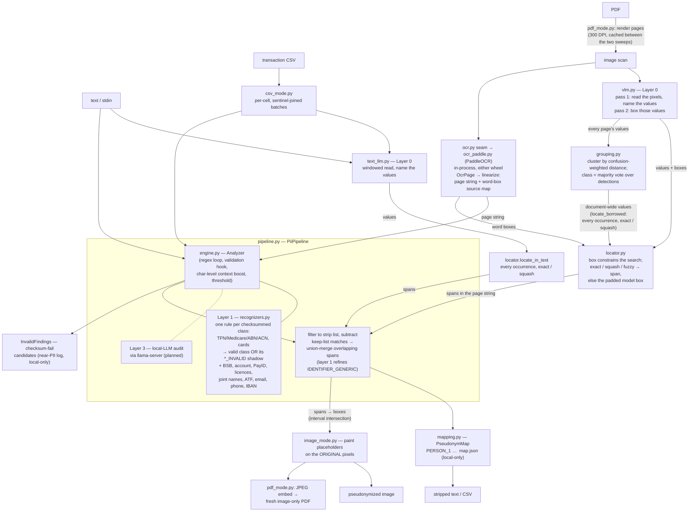

# PII Engine (core) — Architecture & Design Decisions

Living document for the **core PII engine** — the detection/pseudonymization pipeline in
`pii/core/`, independent of any front-end. Split out of the root
[../../ARCHITECTURE.md](../../ARCHITECTURE.md) on 2026-07-14 and moved under `pii/core/` in
the 2026-07-16 component split (component map and dependency rules: the umbrella
[../ARCHITECTURE.md](../ARCHITECTURE.md); the CLI front-end:
[../cli/ARCHITECTURE.md](../cli/ARCHITECTURE.md); the planned GUI: [../gui/](../gui/)). Every
non-obvious architecture or design decision lands here with its rationale and date, so future
changes argue against the *reason*, not just the code. Engine activity overview is in
[ROADMAP.md](ROADMAP.md), open tasks in [TODO.md](TODO.md), completed-task engineering records
in [DONE.md](DONE.md), usage in [../README.md](../README.md).

## System overview

Goal: strip personally identifiable information from documents **locally** so the stripped
version can be shared with cloud models — the inputs are classified and nothing leaves the
machine. Output is **pseudonymized, not redacted**: stable placeholders (`PERSON_1`) with a
rehydratable local mapping. Standalone from the RAG app — nothing here imports `rag_tools`
or the web app; the only planned shared infrastructure is the local llama-server.

### Third-party modules and their roles

| Module | Role |
|---|---|
| `regex` | The regex engine layer 1 compiles with — stdlib `re` cannot do the variable-length lookbehind the account-after-BSB and labeled-identifier patterns need. |
| `tldextract`, `phonenumbers` | The two validators worth not writing: public-suffix check for emails, libphonenumber for AU phone numbers. |
| llama-server (llama.cpp), Qwen3.6-27B | **Layer 0**, the semantic detector — reached over HTTP, never imported. Not a dependency of `pii.core` (stdlib `urllib` transport) but a hard runtime requirement of every strip mode. |
| PaddleOCR (`paddleocr` + a `paddlepaddle` wheel) | The OCR engine behind the image path — **geometry only, never detection** (Tesseract was the first backend, retired 2026-07-17 — decision below). Runs in-process on either wheel since the torch conflict went (2026-08-09). |
| Pillow | Pixel painting — placeholders onto the original image, and the debug overlays. |
| pymupdf | PDF page rendering, reassembly and metadata scrubbing. **AGPL** — revisit before any commercial distribution (decision below). |

### Our modules

All modules below live in `pii/core/`. The front-ends are separate components: the
`strip`/`analyze`/`rehydrate` CLI is `pii/cli/` ([../cli/ARCHITECTURE.md](../cli/ARCHITECTURE.md)),
the planned GUI is `pii/gui/` — both build on this package and never import each other.

| Module | Role |
|---|---|
| `__init__.py`, `constants.py` | Public API surface (`PiiPipeline`, `PseudonymMap`, `RECORD_SEPARATOR`, `DEFAULT_STRIP_ENTITIES`, `InvalidFinding`, `INVALID_ENTITY_TYPES`); `RECORD_SEPARATOR` lives in `constants.py` (zero-import, cycle-free) |
| `pipeline.py` | `PiiPipeline` — **layer 1**: builds the rule set, runs one `Analyzer` pass, filters to the strip list and applies the keep list, union-merges overlaps, collects checksum-invalid findings. `merge_detections` folds layer 0 in on top |
| `detection.py` | `Detection` — the record every layer emits and every consumer reads |
| `engine.py` | `Rule` / `PatternRule` / `Analyzer` — the regex loop, the validation hook, the char-level context boost, thresholding and deduplication |
| `recognizers.py` | **Every** layer-1 rule: the checksummed identifiers (each emitting its valid class OR its `*_INVALID` shadow from one checksum call), BSB, account, PayID, licences, joint names, ATF tails, email, IBAN, phone |
| `checksums.py` | The identifier arithmetic — TFN, Medicare, ABN, ACN, Luhn. Single source of truth since Presidio went; `pii_eval/au.py` mirrors it under a coupling test |
| `mapping.py` | `PseudonymMap` — placeholder allocation, JSON persistence, rehydration |
| `entity_keep.py` | The keep list: what is detected but NOT stripped, per entity type, loaded from `data/entity_keep.txt` (or any path) |
| `csv_mode.py` | Per-cell transaction-CSV processing |
| `vlm.py` | **Layer 0, pixels** — a local vision LLM reads the page image and names the PII; transport, both prompts (detect / localize), parsing |
| `text_llm.py` | **Layer 0, text** — the same model reading document text instead of a page; windowing, prompt, per-window deduplication |
| `text_mode.py` | Text front-end: layer-0 detect → locate → splice placeholders. The text counterpart of `image_mode` |
| `grouping.py` | The fold between the two sweeps: every page's findings → document-wide entity groups, class elected by majority vote |
| `locator.py` | Layer-0 findings → spans. Three placement paths: box-guided in the OCR text (`locate_findings`, three geometry tiers), document-wide values against one page (`locate_borrowed`), and plain occurrence search in document text (`locate_in_text`) |
| `fuzzy.py` | Confusion-weighted Levenshtein — the fuzzy tier of location, admissible only inside a box |
| `ocr.py` | OCR-engine seam (`get_ocr_page`) + the shared pixel toolkit (`Box`, `_rows` banding, word-box normalization) |
| `ocr_page.py` | Perception: `OcrPage` → `OcrLine` → `OcrWord` + `OcrFrame`. Geometry only, no character offsets |
| `linearization.py` | `OcrPage` → `RecognizerInput`: the flat page string plus the source map that turns a span back into pixel boxes |
| `ocr_paddle.py` | PaddleOCR adapter: line-oriented det/rec → per-word `OcrPage`; in-process on either wheel, and holds the torch guard that keeps it safe |
| `debug_overlay.py` | `strip --debug` renderers: the ocr / layer-0 / layer-1 diagnostic layers drawn onto the page a run processed |
| `paint.py` | The drawing toolkit (`Segment`, `paint_segments`, fill/frame styles), shared by strip and the debug overlay |
| `image_mode.py` | Image front/back-end: layer-0 detect, locate in the OCR text, paint placeholders onto the original pixels |
| `pdf_mode.py` | PDF render + reassembly legs: pages → pixels → image pipeline per page → fresh image-only PDF (`pdf_to_images`, `strip_pdf`) |

### The whole picture

## Pipelines

### Text — the core; every other mode wraps it

Detection is layer 0 (`text_mode.detect_text`), and there is no alternative — see the layer-2
retirement below. `text_llm.py` reads the document text in overlapping windows and names the
values; `locator.locate_in_text` then marks **every** occurrence of each one, and layer 1
refines, validates and extends the result exactly as on the image path (`merge_detections`).
There is no geometry leg — the model quotes from the very string it was handed, so a located
value needs no reconciliation. See "Layer 0" below.

Layer 1 on its own stays reachable as `PiiPipeline.detect` — as a *layer*, which is what
`merge_detections` consumes — but never as a way to strip a document: `strip_text` and
`strip_csv` require a detector, because a patterns-only strip is the `--no-ner` regime retired
2026-07-15 as unsafe and must not be reachable by omitting an argument.

`PiiPipeline` then: (1) filters to strip-listed entity types, (2) union-merges overlapping
spans, (3) allocates placeholders in document order from the `PseudonymMap` and splices them
in right-to-left so offsets stay valid (`pipeline.apply_plan`, shared by both modalities — a
plan's provenance must not change how it is applied). The same pass also yields the
checksum-invalid findings (collected, deduplicated, optionally masked). `rehydrate` is the
inverse: placeholders in a cloud answer are replaced with the first-seen surface forms from
the mapping.

### CSV — per-cell wrapper

Cells of a column are batched into one analyzer call, joined by a sentinel (`␞`) no
recognizer can match across, with a hard alignment check afterwards; NER spans are clamped
per cell. Placeholders can never straddle cell boundaries; date/amount columns pass through
byte-identical. See the CSV decision below.

### Image — detect, locate, paint

Front-end: OCR the page into an `OcrPage` and `linearize` it into the flat page string plus a
source map recording `(char_start, char_end, bbox)` per word *as it is written*. Detection is
layer 0 — two model passes name the values and box them, and `locator.locate_findings` turns
each into a span of that string using the box to constrain the search. Beside it,
`locator.locate_borrowed` marks every occurrence of every value the **document** knows about,
including ones layer 0 said nothing about on this page (see the grouping decision below).
Layer 1 then supplies the precise classes, the checksum shadows and a recall floor. Back-end
(`image_mode.py`): mapping merged spans to boxes is pure interval intersection over the
recorded intervals; each span's placeholder is painted over its boxes on the **original**
image (background-filled box with the placeholder text drawn in — pseudonymization, not
blackout), emitting the same rehydratable `map.json`. Layer-0 findings that match no OCR text
are painted from the model's own padded box and counted apart (see "Layer 0" below).

### PDF — two sweeps over the image pipeline, reassembled from scratch

`strip_pdf` (`pdf_mode.py`, 2026-07-18; two sweeps 2026-08-11) **reads** every page — render
at 300 DPI (default) → detect → localize → OCR — then groups the findings across the whole
document, then **redacts** every page against that shared view (locate → layer 1 → paint) and
embeds each painted page into a **fresh** pymupdf document at the source page's physical size
in points. Nothing is copied from the source document object, so text layers, annotations,
attachments and metadata are absent by construction (the metadata dict is explicitly emptied
on top); the hidden-text-leak class cannot survive. One pipeline instance, one OCR engine and
one shared `PseudonymMap` serve all pages, so placeholders are consistent across the
document. Rendered pages are cached to disk between the sweeps rather than rendered twice —
rationale in the grouping decision below. Processing is lossless end-to-end; only the final embed
is lossy — JPEG q90 (decision 2026-07-18; the eval scorer re-OCRs output pixels, so encoding
damage is measured, not hidden; configurability is a recorded TODO). Rationale for
pixels-first is in the "PDFs as rendered images" decision below.

## Detection stack

**Two** live layers today, unioned — no single detector catches everything (2026-07-05). A
third is planned and contingent; the second was retired. The numbering is kept as it was
assigned, so the record and the code agree:

| Layer | Engine | Owns | Status |
|---|---|---|---|
| 0 | Local LLM reading the page image (`vlm.py`) or the document text (`text_llm.py`) | everything, semantically — refined, validated and extended by layer 1 | pixels shipped 2026-08-08 (default 2026-08-09); text shipped 2026-08-09. **The only detector** since layer 2 was retired |
| 1 | Our own pattern/checksum engine (`engine.py` + `recognizers.py`) | TFN, Medicare, ABN/ACN, BSB, account, PayID, cards, email, phone, IBAN; the `*_INVALID` shadows of each checksummed class | shipped; on Presidio until 2026-08-09 |
| 2 | ~~GLiNER2 zero-shot NER~~ | PERSON, ORGANIZATION, ADDRESS, DATE_OF_BIRTH | **retired 2026-08-09** — layer 0 replaced it (decision below) |
| 3 | Local LLM audit (llama-server) | contextual identifiers ("the borrower's wife, a dentist in Wagga Wagga") | planned |

**Layer 0 replaced layer 2 outright on 2026-08-09**; there is no detector choice left. Every
strip mode runs layer 0 and merges layer 1 on top (`merge_detections` — refine, validate,
extend), so a run is a union of 0 and 1. The mode entry points *require* a detector: layer 1
alone is the `--no-ner` patterns-only regime retired 2026-07-15 as unsafe, and it must not be
reachable by forgetting an argument. `PiiPipeline.detect` still exposes layer 1 on its own —
as a *layer*, which is what `merge_detections` consumes, never as a way to strip a document.

Consequence, accepted knowingly: **every input mode now requires a llama-server**, including
the tier-1 acceptance gate. There is no offline path.

Standalone `LOCATION` detection was retired 2026-07-23 (decision below) — bare place names
pass verbatim.

### Presidio and spaCy retired; the engine is ours (2026-08-09)

`pii/core/engine.py` (~190 lines) replaces `AnalyzerEngine`, `RecognizerRegistry`,
`PatternRecognizer` and `LemmaContextAwareEnhancer`. What we actually used of Presidio was a
regex loop, a three-way validation hook, a context boost and a threshold; what it cost was a
mandatory spaCy NLP engine, ten recognizers we never stripped on (US SSN/bank/passport/ITIN,
NHS, crypto, MAC, medical licence, DATE_TIME) running on every call, and — the reason this
became urgent — a **split ownership of every checksummed identifier**.

**The split was a live leak, not a tidiness problem.** Presidio owned the valid classes and our
shadows owned the invalid ones, each with its own pattern set and its own copy of the
arithmetic. Presidio's AU patterns accept SPACE-grouped digits only; the shadows accept `[- ]`.
So a hyphen-grouped **valid** TFN/ABN/ACN/Medicare (`123-456-782`) matched Presidio not at all
and was dropped by the shadow *for passing its checksum* — detected by nothing, in all four
classes. The corpus could not see it: `pii_eval/au.py` only ever emitted space-grouped forms.
`ChecksumRule` now matches once, extracts digits once, calls the checksum once and branches, so
the two halves cannot disagree — and `pii/core/checksums.py` becomes the single source of truth
rather than a mirror that had to stay bit-identical to a dependency (the 2.2.364 ABN change had
already proved that hazard). This closes the standing "stop duplicating Presidio's checksum
arithmetic" item by deletion.

Three scoring behaviours are reproduced exactly, because every score in `recognizers.py` was
tuned against them: validation overrides the pattern score (True → 1.0, False → drop, None →
keep), the context boost is +0.35 floored to 0.4 and capped at 1.0, and duplicate spans collapse
to the highest score. Pinned in `tests/pii/core/test_engine.py`.

**The context match moved from spaCy lemmas to characters, and that is an upgrade.** The
2026-07-15 spaCy source review found the lemma path actively broken on this text: `a/c` splits
into three tokens while `TFN:123456782` stays one, so the label word never surfaced as a token
either way, and the rule lemmatizer left HEADER-CASE labels unlemmatized on top. Its conclusion
was "keep label/context matching char-level"; `AuAccountNumberRule` had already worked around
the gap by matching `a/c` inside its own pattern. A 60-character window before the match,
searched case-insensitively for the context term as a substring, is what that review asked for
and needs no NLP engine.

**One label change came out of the merge**: a label is matched as a LOOKBEHIND, so it stays
outside the span. The old shadows matched labels in-span and got away with it (an invalid
candidate is reported, not aliased), but for a *valid* identifier a span covering "TFN: 123 456
782" keys the pseudonym map on a different string than a bare occurrence — one identifier
forking into TFN_1 and TFN_2 inside a document. Caught by the placeholder-consistency test.

**What it bought beyond correctness**: no spaCy, no thinc, no torch. That is what let the paddle
worker subprocess be retired the same day (decision below) — the DLL conflict it isolated only
existed because the analysis stack dragged torch in transitively.

**Layer 1 is what makes an identifier trustworthy.** Layer 0 names identifiers but structurally
cannot verify them — it reads a TFN, it cannot check mod-11 — and its class vocabulary is coarse
on purpose, so layer 1 is what *types* a digit run at all and what validates it. That is why the
chassis swap did not shrink layer 1's role: it only changed who runs it.

## Design decisions

### Pseudonymization over redaction (2026-07-05)

PII is replaced with stable placeholders (`John Smith → PERSON_1` everywhere, across a whole
document set), not blanks. Rationale: the cloud model can still reason about "PERSON_1's
recurring rent payments", and its answers are **rehydratable** — a local reverse pass restores
the real values. The mapping store (JSON) contains the original PII: it is gitignored and must
never leave the machine.

- Placeholders are allocated in document order (readable mappings) and matched
  case-insensitively with whitespace collapsed; rehydration restores the first-seen surface
  form.

### Phone regions are AU-only (2026-07-22)

`PhoneRule` hands libphonenumber the **AU region only** (issue #11 follow-up, Sergei's option A;
it was AU+US+GB). With US in the list, libphonenumber read account+amount digit runs
('A/C 30-743-3257 1.50' → '3074332571') as valid US numbers and the merged span re-swallowed
the amount the labeled-account guard had just released. Zero measured loss: international
'+'-prefixed numbers are parsed region-independently ('+1 305 555 0123' still strips), AU
13-numbers/1800/mobiles unaffected — the only sacrifice is bare US/GB-domestic-format
numbers, which don't occur on AU statements.

### Recall-first span handling (2026-07-12 — two leak classes found and designed out)

Scoring philosophy: a false positive costs some analytical utility; a false negative leaks
classified PII. Every ambiguity resolves toward stripping.

- **Filter before overlap resolution.** Detected spans are filtered to strip-listed entity
  types *before* overlaps are resolved. Found the hard way on the retired chassis, whose
  `DATE_TIME` detector emitted bogus high-score spans over account and phone numbers: if
  kept-type spans are allowed to compete, they shadow real PII, which then leaks. The rule
  outlived the detector that motivated it — layer 0 still emits a kept class (ORGANIZATION)
  over the same text as a stripped one.
- **Merge overlapping PII spans; never rank them.** Highest-score-wins let a small `AU_BSB`
  span (0.55) evict a wider account-number span (0.52) that covered it, exposing the
  remainder. Overlapping strip-listed spans are unioned into one replacement (entity type of
  the highest-scored member; invalid classes rank below any valid type). The general merging
  algorithm (weight combination, disagreeing classes, kept-type nesting) is still to be
  defined — see the overlaps task in TODO.md.

### Layer 2 (GLiNER2) retired — layer 0 replaced it (2026-08-09)

GLiNER2 was the zero-shot NER backend from 2026-07-12 and owned PERSON, ORGANIZATION, ADDRESS
and DATE_OF_BIRTH. It is deleted. The A/B that decided it is
[reports/2026-08-09-text-layer0-vs-gliner2.md](reports/2026-08-09-text-layer0-vs-gliner2.md):
on the tier-1 corpus at seeds 42/123/7, with layer 1 held constant and the semantic detector
as the only variable, layer 0 was **equal or better on every class and every seed**, took
`PERSON_REVERSED` from 89/95/95% to **100% on all three** (closing a residual that had carried
its own TODO item since 2026-07-15), and **over-stripped less** on ORGANIZATION — the axis a
carve-out-free prompt was expected to hurt.

What went with it, and why none of it is worth resurrecting separately: the whole family of
workarounds existed to compensate for a span-labelling model reading flat text. Prediction
windowing (encoder memory), per-cell window isolation at `RECORD_SEPARATOR` (same-person
mentions in two word orders interfered inside one attention window), `max_width=12` (the
trained default of 8 could not emit a one-line AU address), dedicated single-label ADDRESS
passes (label competition inside a schema), honorific extension, reversed-name re-finding,
adjacent-fragment coalescing, and post-validation of the model's identifier guesses (it
labelled bank receipt references as TFNs semi-randomly). Layer 0 has none of those failure
modes, so it needs none of those repairs. Records and eval numbers stay in [DONE.md](DONE.md);
the code is one revert away in git history, the same disposition as Tesseract and Surya.

Two things did NOT come free, both logged in [TODO.md](TODO.md) rather than fixed here: the
invalid-identifier feature lost its *context*-tier coverage (GLiNER2's post-validation had been
demoting shape-correct checksum failures, which the shadow recognizers do not collect at the
default `likely` tier), and layer 0 strips a checksum-failed identifier under
`IDENTIFIER_GENERIC` regardless of `--mask-invalid-identifiers`, breaking that feature's
report-vs-mask separation.

One consequence beyond detection: the `csv_mode` sentinel keeps only one of its two jobs — it
still stops pattern recognizers matching across cells, but it is no longer an attention-window
boundary.

**A consequence that took one more step than expected:** removing GLiNER2 did NOT make the
pipeline torch-free. It was the only *direct* consumer, but spaCy's `thinc` ships a PyTorch shim
and loads real torch eagerly, so `import presidio_analyzer` alone still pulled it in with CUDA
live (measured 2026-08-09, when the paddle-worker retirement was attempted on the strength of
the wrong assumption). Retiring the chassis the same day is what finished the job — see the
paddle worker decision below.

One layer-1 rule outlived the retirement and should not be mistaken for NER leftovers:
`AuAccountNumberRule`'s >=5-digit floor (`validate`). It was introduced alongside
the GLiNER2 guess floors on 2026-07-14 but is a property of the account *pattern*, not of any
model.

### No standalone place-name detection (2026-07-23)

**A lone city or town name passes verbatim** — 'Security property is in Cairns' is not
redacted. `LOCATION` is in neither `DEFAULT_STRIP_ENTITIES` nor the placeholder map, and
nothing in either layer claims the class. Acceptable in mortgage-policy and bank-statement
documents, and not worth the false-positive surface a dedicated pass costs. What still strips
is unchanged: layer 0 owns ADDRESS, so full addresses and suburb-state-postcode lines go, and
a suburb in clearly address-flavoured context ('resided in Kew') is caught as ADDRESS — an
intended residual overlap. Contextual identifiers that are neither addresses nor layer-1 types
are deferred to the planned layer-3 audit.

History, all in DONE.md: a dedicated NER LOCATION pass shipped 2026-07-15 — chosen
head-to-head over spaCy LOCATION, which is blind to towns like 'Wagga Wagga'/'Dubbo' — and was
retired 2026-07-23 when the policy above was adopted, taking its `LOCATION_MIN_CHARS=4` floor
trade-off with it. spaCy's own NER had been retired as a detector earlier the same week (glue
PERSON spans across line breaks on OCR text, date-as-PERSON false positives), and the library
itself went with the chassis on 2026-08-09 — decision above.

**The `--no-ner` patterns-only regime is gone** (Sergei, 2026-07-15): its name leaks made it
unsafe. That ruling is why the mode entry points *require* a layer-0 detector today —
patterns-only must not be reachable by forgetting an argument.

Layer-1 composition is regression-tested in `tests/pii/core/test_registry_policy.py`: no rule
claims ADDRESS or DATE_OF_BIRTH, PERSON is claimed only by the mechanical `JointNameRule`, the
retired detectors stay absent by name, and a **subprocess** probe asserts that building a
pipeline — front-ends included — imports neither presidio, spaCy, thinc nor torch.

### Mechanical joint-name forms are layer-1 patterns, not an NER problem (2026-07-15)

`JointNameRule` (pii/core/recognizers.py, emits PERSON) owns the joint-account name
shapes: initials-pair 'E & J Moore' (@0.5) and shared-surname 'Julie and Brian Summers' /
'JULIE AND BRIAN SUMMERS' (@0.45). Rationale from the raw-emission diagnostic (DONE.md):
the NER model of the day labelled these forms confidently (0.93+) in clean context but lost
*span segmentation* when adjacent ref-codes/keywords crowded them in transaction lines — glue
spans, dropped initials, split pairs. The very regularity that broke the model makes the forms
pattern-matchable, so the rule belongs in layer 1. It outlived the layer-2 retirement as a
deterministic floor under a stochastic detector, which is layer 1's standing job.

Two design points:

- **Confident scores, no context gating.** The context boost only looks *backward*, over a
  short window (60 characters now; 5 tokens under the Presidio enhancer this was tuned
  against), and on statement lines the joint name routinely trails a payee/ref tail longer
  than that. A context-promoted sub-threshold pattern — the account-number idiom — would
  systematically miss exactly the lines this rule exists for.
- **Precision guard is a positional stop-vocabulary, not a floor.** 'X AND Y Z' caps
  triples collide with statement phrases ('PRINCIPAL AND INTEREST PAYMENT') and org names
  ('TAYLOR AND SCOTT LAWYERS PTY LTD'). `validate` checks by slot (reworked in the
  2026-07-15 review round — the first any-position version sacrificed real surnames like
  Fee/Card): given-name slots reject statement vocabulary (phrases carry their giveaway
  word there), the surname slot rejects only corporate markers, and a corporate-tail
  lookahead on the patterns keeps '... LAWYERS PTY LTD' orgs intact. Remaining accepted
  trade-offs, recall-first, each pinned by a pytest test AND measured by a dedicated eval
  keep-probe: orgs in the joint-name shape with no corporate marker anywhere ('P & O
  CRUISES') strip — `ORGANIZATION_AND_BARE`, expected over-strips; guarded org forms must
  stay kept — `ORGANIZATION_AND` (7/7 kept on both seeds at ship time); colliding-surname
  couples ('Julie and Brian Fee') are drawn as ordinary critical PERSON, so a guard
  regression trips the gate.

**Accepted as a standing loss (2026-08-09, Sergei).** When the shared surname is *also* a
banking word the given names strip and the surname survives — `LOAN REPAYMENT PERSON_5 FEE` —
which fails seed 7's critical gate. It fails under **both** detectors: layer 0 inherits the
residual rather than fixing it (it does downgrade seed 7's full leak to a partial). A surname
like Fee in bank-statement context is not worth further precision engineering, so seed 7's
failure is a known trade-off, not an open regression. Record:
[reports/2026-08-09-text-layer0-vs-gliner2.md](reports/2026-08-09-text-layer0-vs-gliner2.md).

With this, `PERSON_JOINT` moved into the eval's CRITICAL gate (100% on seeds 42/123).
`PERSON_REVERSED` ('MOORE OLGA') stays a per-form probe — two bare caps words admit no
pattern, so it never had a layer-1 owner and never will — but the residual that kept it out of
the gate **closed with the layer-2 retirement**: layer 0 scores 100% on seeds 42/123/7 where
GLiNER2 scored 89/95/95. Promoting the probe into `pii_eval` `build.CRITICAL` is the remaining
step, and is a TODO item.

### What is deliberately kept — a configurable keep list (2026-08-11)

**A detected value is stripped unless the keep list matches it, and a match exempts only what it
covers** (`entity_keep.py`, the file `data/entity_keep.txt`). Merchant and institution names —
the analytical substance of spending data — survive by being *on* that list; `DATE_TIME`
(transaction dates) survives by not being a strip entity at all; `DATE_OF_BIRTH` strips.

**Subtracting, not exempting** (`PiiPipeline.apply_keep`), because a detected span is routinely
wider than the listed name: layer 0 reads a whole narrative field as one organization, and
`SK BUSINESS TRUS ANZ HIGHETT LOAN` was kept in full — three times on one page — for containing
`ANZ`. The match now survives and the rest of the span strips around it. Two guards keep that
from shredding text: the match grows to its whitespace-delimited token (`www.anz.com` stays
whole instead of becoming `ORG.ANZ.ORG`), and a remainder under `_KEEP_REMAINDER_MIN`
alphanumerics is left alone (`ANZ App`, `TO ANZ LN`). Both were added after a real run turned
one page's URLs and connectives into eight placeholders. Sections scope patterns to a class
(`[PHONE_NUMBER]` for an institution's 1300 line), unsectioned lines mean ORGANIZATION, and a
class the file does not mention keeps nothing. `--strip-orgs` drops the ORGANIZATION section;
per-run entity-type selection is still a planned feature (TODO.md).

**This inverts the 2026-07-12 stance** (keep every organization, strip only names carrying an
Australian legal-form marker — PTY / TRUST / ATF / SMSF — and not on an institution list). The
old rule needed *evidence* to strip, and a real page destroys the evidence while keeping the
identifying name: a statement's fixed-width narrative printed the holder's `SK BUSINESS TRUST`
as `SK BUSINESS TRUS`, which matched no marker and was kept three times on one page — while the
same value stripped in full elsewhere in the document. Its sibling failure was structural too: a
span fused by OCR across a column gap (`SK ... TRUS ANZ HIGHETT`) rode the institution list to
safety. Requiring evidence to KEEP instead cannot fail that way — a mangled fragment cannot fake
presence on a list someone wrote down.

The cost is deliberate and measured on the eval's over-strip axis: an unlisted merchant becomes
`ORG_n`. That is the recoverable direction (an over-strip loses analytical value; an under-strip
is a breach), and the file is the dial. The eval harness scores against its **own** list
(`pii_eval/entity_keep.txt`) so the keep axis measures the tool rather than the overlap between
two lists.

One special case died with it: ORGANIZATION is now an ordinary member of `DEFAULT_STRIP_ENTITIES`
and `_in_strip_plan` has one rule for every class — on the strip list, and not exempted by value.

### Checksum-invalid identifiers are surfaced, not silently dropped (2026-07-14; one-rule ownership 2026-08-09)

A value shaped like a TFN whose mod-11 arithmetic fails is a typo, bad OCR, or forgery — all
three worth reporting. **One `ChecksumRule` owns both halves of its digit space**: it matches
once, extracts the digits once, calls the checksum once, and emits either the valid class or
its shadow — `*_INVALID` (checksum fails) or `*_MALFORMED` (structurally impossible), the
typo-vs-impossible distinction being exactly the forgery signal. The two halves used to live in
separate modules with separate pattern sets and disagreed silently; that leak is what retired
the Presidio chassis (decision above), and they must not be split again.

Three orthogonal CLI controls — collection tier, log, mask. The tiers are defined by *where the
evidence sits*: in-span grouping or a label → `likely`; a context term in the 60-character
window before the match → `context`; any failing match at all → `all`, which is noise.
Guardrails: a candidate covered by a *validated* detection is suppressed, keyed on the
validating rule's name rather than on the entity type — a semantic guess must never suppress a
checksum candidate — and invalid classes always lose the placeholder to valid types on overlap.
Adopted defaults: `likely` + log + no mask. **The findings log is near-PII** (a typo'd TFN is a
real TFN minus a digit) — a local-only artifact, like `map.json`.

Layer 0 disturbed this feature in two ways, both still open (TODO.md): the `context` tier lost
its only real source when GLiNER2's identifier post-validation went with it, and layer 0 strips
a checksum-failed identifier as `IDENTIFIER_GENERIC` whatever `--mask-invalid-identifiers`
says, which breaks the report-vs-mask separation the feature is built on.

Full design narrative, eval numbers and follow-on findings: DONE.md.

### CSV handling (2026-07-12)

Bank transaction lists are processed **per cell**, optionally restricted to named columns:
placeholders can never straddle cell boundaries, and date/amount columns pass through
byte-identical. Cells of a column are batched into one analyzer call, joined by a sentinel
(`␞`) no recognizer can match across, with a hard alignment check afterwards. Side benefit
observed: cell-level context avoids some of the over-stripping seen in whole-text mode.

### PDFs are processed as rendered images (decided 2026-07-05; render leg 2026-07-17; reassembly leg 2026-07-18)

Financial-sector PDFs often carry junk/broken text layers (confirmed: one reference statement
has one, and d04 of the real corpus hides an account number under a white cover rectangle),
and rebuilding output from pixels eliminates the hidden-text-layer leak class entirely.
Corollary requirement from the reference docs: mailing barcodes (Australia Post 4-state)
encode the delivery address and are invisible to text-based detection — the image pass must
detect and mask barcode regions.

- **Renderer: pymupdf** (2026-07-17, over poppler/pdftoppm and pypdfium2) — `pii/core/pdf_mode.py`.
  Self-contained pip wheel, in-process rendering, and the same library later covers
  reassembly, the belt-and-braces text-layer scan, and metadata scrubbing. **AGPL-licensed**:
  fine for internal use, revisit (Artifex commercial license, or swap the seam to pypdfium2)
  before any commercial distribution — the render seam keeps the swap contained.
- **300 DPI default**: statements ship 7–9 pt body text; at the synthetic tier's 150 DPI those
  glyphs fall below the sizes the OCR fidelity sweep validated. Pages stream as a generator —
  a 300 DPI A4 page is ~26 MB of pixels, so callers process per-page instead of holding a
  document.
- **Reassembly from scratch, lossless until the final embed** (2026-07-18): the output
  document is built fresh (see the PDF pipeline section above) — nothing structural from the
  source can survive. Processing stays on raw RGB renders throughout; only the embed into the
  output PDF is lossy (JPEG q90 — ~0.2 MB/page vs 1–4 MB lossless; the eval scorer re-OCRs
  output pixels, so encoding damage is measured, not hidden). Encoding configurability is a
  recorded TODO.

### Image-path invariants, harvested from a package we declined (2026-07-14)

The image path was built around our own pipeline rather than Microsoft's
`presidio-image-redactor`, whose `ImageRedactorEngine` draws filled boxes (blank redaction,
where we pseudonymize) and hooks in below everything that makes this tool ours — recall-first
union merging, invalid-identifier collection, strip planning, the pseudonym map. That choice is
moot now that Presidio is gone entirely, but the source review behind it produced four rules
that are load-bearing and still govern the code. Their span→bbox mapping was the *what-to-avoid*
exhibit: it re-derives character offsets inside its matching loop and carries two silent-leak
classes.

- **Record `(char_start, char_end, bbox)` per word at assembly time; never re-derive an offset
  from string lengths.** Span→boxes is then pure interval intersection, over *merged* spans and
  never raw detections — which makes the overlapping-results leak inexpressible rather than
  guarded against. This rule lives on `linearization.RecognizerInput`.
- **Coordinate discipline.** Any OCR preprocessing feeds OCR *only*; painting happens on the
  original pixels, with explicit scale/offset metadata mapping boxes back.
- **Keep-listing belongs in the text layer only.** Their per-word allow-list recheck at paint
  time is a leak vector. The paint layer follows merged spans exactly and makes no policy
  decision of its own.
- **The image-tier eval matches painted boxes with pixel tolerance, never exact coordinates** —
  exact-box assertions break across engine versions.

Two smaller notes kept because they cost nothing: a per-document deny-list of
known-by-construction values (account-holder name, account number) is a cheap recall booster,
and tightly-cropped inputs want padding before OCR. Full harvest in DONE.md.

### OCR backends are interchangeable adapters; a local VLM is not (2026-07-14)

The engine seam is `ocr.py::get_ocr_page(backend) -> (image, lang=...) -> OcrPage`
(`OCR_PAGE_BACKENDS`; an entry selects a model tier, e.g. `paddle:v6_medium`). Any engine
normalizes into that contract — polygons → axis-aligned envelopes — so the recognizer feed and
the paint layer never learn which one ran. Tesseract was the first adapter and PaddleOCR is the
only one today; Surya and the two layout backends were built against this seam and retired
through it, which is the evidence that it holds.

The exception the title names is a local VLM doing OCR *and* PII detection in one pass: that
cannot be expressed as an OCR adapter feeding an analyze step, so it joins at the merged-spans
level instead — **built 2026-08-08 as layer 0**, decision below.

Three structural rules the PaddleOCR adapter (`ocr_paddle.py`) established, which the seam now
carries:

- **Process rules are part of a backend's contract.** On Windows, paddlepaddle-gpu and torch
  cannot share a process (bundled-cudnn mutual exclusion; full story in the adapter docstring
  and the 2026-07-17 DONE record). That once forced a worker subprocess; since 2026-08-09
  nothing in the strip path imports torch, so the GPU wheel runs in-process everywhere and the
  worker is retired (decision below). The adapter installs a torch *stub* to satisfy
  paddleocr's modelscope import chain.
- **Package inits stay lazy (PEP 562) — load-bearing.** `pii/__init__` and `pii/core/__init__`
  resolve their public names lazily, so `import pii.core.ocr` never drags the analysis stack in
  behind it. The original reason — keeping OCR-only processes torch-free against the
  presidio → spaCy → thinc → torch chain — is weaker now that the chain is gone, but the
  property is cheap and the guard stays. Don't re-add eager imports to those `__init__`s.
- **Backend model caches follow the repo convention**: `models/paddlex`, via
  `PADDLE_PDX_CACHE_HOME`, set by the adapter.

### Paddle worker-process isolation — built 2026-07-17, RETIRED 2026-08-09

The GPU paddle wheel and torch cannot share a Windows process: both bundle
`cudnn_cnn64_9.dll` from different CUDA families and the second loader gets WinError 127,
whichever the order. With Tesseract retired, the image pipeline had to run both — GLiNER2 on
torch for detection, paddle for OCR — so paddle moved into its own interpreter: a persistent
worker subprocess (`ocr_worker.py`) spawned lazily, PNG bytes in and a pickled `OcrPage` back
over a framed stdio protocol.

**It is gone, because its premise is.** Nothing in the strip path imports torch any more.
GLiNER2 was the only *direct* consumer, but removing it was not enough — spaCy's `thinc` ships
a PyTorch shim and imports real torch eagerly, so `import presidio_analyzer` alone kept torch
in `sys.modules` (measured 2026-08-09, and it is why the worker survived the layer-2
retirement by a few hours). Retiring Presidio and spaCy the same day is what actually made the
process torch-free. Verified before deleting anything: the full analysis stack plus in-process
GPU paddle in one interpreter, on the 2080 Ti, correct OCR output.

`get_ocr_page` now returns the in-process callable on either wheel. What remains, and must:

- **The torch guard in `ocr_paddle._engine`.** It refuses to start when a real torch is in
  `sys.modules`, which turns a future re-introduction into a clear error instead of a DLL
  crash. It is now the only thing standing between the two libraries.
- **The torch stub (`_stub_torch`).** paddlex hard-imports modelscope, which hard-imports
  torch at import time; the stub satisfies that without loading the real DLLs.
- **Lazy package inits (PEP 562).** `pii/__init__` and `pii/core/__init__` still resolve their
  public names lazily. The reason is weaker than it was — the analysis stack is light now —
  but `import pii.core.ocr` still must not drag in the pipeline.

The worker and its protocol tests are one revert away in git history, the same disposition as
Tesseract, Surya and the layout backends.

### OCR perception layer: OcrPage / linearization (2026-07-24, narrowed 2026-08-09)

**OCR supplies geometry, not detection.** Layer 0 reads the page image and names the values;
`locator.py` then matches each one against the OCR text and paints exact word boxes, because
the model's own boxes are measured unsafe to paint (see "Layer 0" below — they *are* used, as
a search constraint, which is a different job). Everything in this layer serves that single
purpose, which is why it is as small as it is — the layout/segmenter half of it was retired
2026-08-09 (rationale at the end of this section; full record in DONE.md).

- **The hierarchy (`ocr_page.py`).** `OcrPage` → `OcrLine` → `OcrWord`, plus an `OcrFrame`
  (raster size, dpi, source, page, backend/tier). Perception holds geometry only — **no
  character offsets** (see linearization). `region_box` is *per-word*, not per-line: a visual row
  can merge several detection regions, each with its own line box, and the paint geometry
  depends on it.
- **A line is never dropped.** Every row carrying words becomes an `OcrLine`, unconditionally —
  a dropped OCR line is unredacted PII. There is no filtering, scoring or grouping step that
  could swallow one.
- **A line box contains its glyph ink (`_line_box`, 2026-07-27).** `OcrLine.box` is the union of
  the line's word boxes **with their region boxes**. Engine word boxes are *inset* from the ink
  while the detection region box contains it, so a box built from word boxes alone slices the
  first and last glyph (measured: 50 of 53 lines on a real statement page lost up to 8 px of ink
  at 200 dpi). Union rather than the region alone because paddle occasionally emits a region that
  does not contain its own words — the same defence `painted_boxes_for_span` applies when growing
  a paint run, so the box can never end up narrower than the words it holds.
- **`_rows` visual banding is load-bearing, not cosmetic.** Detection regions carry no reading
  order, so they are banded into rows by y-centre and each row becomes one line, left to right.
  This is what puts a label and its value from two side-by-side regions onto **one** assembled
  line — which is how context promotion reaches an account number sitting in a column beside its
  own label (`d11.p2`). A tall neighbour (a logo) must not bridge two stacked lines, hence the
  x-overlap guard: two regions sharing an x-column are stacked lines, not one row (issue #6).
- **Linearization is a separate layer (`linearization.py`).** The recognizer and the locator both
  run on one flat string; `linearize(OcrPage) -> RecognizerInput` produces it plus a **source
  map** (each char range → the OCR geometry it came from). Character offsets are born *here* — an
  offset is a property of the (page, assembly) pair, not of a line. The anti-silent-leak rule
  (record `(start, end, box)` at construction, never re-derive from lengths — the
  presidio-image-redactor leak class) lives on the source map. `RecognizerInput` is the **single**
  implementation of span→box mapping; the parallel flat `OcrResult`/`assemble` copy of it was
  deleted 2026-08-09.
- **`get_ocr_page(backend)` — one implementation, in-process on either wheel** (it routed the
  GPU wheel through a worker subprocess until 2026-08-09; the DLL rules that made it necessary
  are still in `ocr_paddle.py`, and so is the guard that enforces them). Strip, diagnostics and
  the eval harness all go through it, so there is *no* second OCR path and the diagnostics
  exercise exactly what a release run uses. A backend name is simply a model tier.
- **Diagnostics are a by-product of a real run (`debug_overlay.py`, `strip --debug`).** Four
  independently selectable layers — **one per pipeline STAGE** — drawn onto the page the run
  processed: `ocr` (word boxes, assembled line boxes numbered — the `_rows` banding made
  visible), `layer-0` (what the model itself produced: its class on its own `bbox_2d`, and
  nothing where it gave no box, so a `--geometry ocr` run draws an empty layer), `locate` (what
  `locator.py` then did with each finding — the resolved span, chipped with the tier that
  resolved it), `layer-1` (the merged plan: the boxes actually painted, the class after
  refinement, and each span's source — `L0` / `DOC` borrowed from the document / `L1`
  pattern-only). Drawing reuses `pii.core.paint`; the module loads no model, so a GUI can render
  a page without the strip stack.
  **The layer-0 / locate split is the point, not tidiness (Sergei, 2026-08-11).** Layer 0 is the
  VLM alone with its rough boxes; which tier placed a value is decided *after* it, from the OCR
  text with that box as a search constraint. An overlay that chipped the tier onto the model's
  box would file the locator's answer under layer 0's name — and, worse, had to substitute
  located geometry wherever the model gave no box. Drawn apart, the two rectangles over one value
  ARE the "a box is a search constraint, not paint geometry" invariant, and a finding nothing
  could place shows as a layer-0 box with no `locate` box over it: the unredacted-detection
  signal, visible by absence rather than by a word.
  **One file per layer, never combined.** Four layers on a dense statement page collide into
  noise, and the pair most worth comparing overlaps by construction; separate files diff page by
  page in any viewer (`DebugSpec.paths` inserts the layer name before the extension).
  **Attached to `strip` rather than a standalone command, deliberately (2026-08-11).** Every
  artifact it draws already exists inside a run that paid minutes per page for the model; a
  separate command would pay twice *and* would show its own re-run rather than the run that
  produced the output — which is precisely how the OCR-only `pii debug ocr` it replaces went
  stale. On PDFs the overlay is built inside sweep 2 from the CACHED raster (`strip_pdf`,
  `DebugSpec`): the model's boxes live in that raster's coordinate space, and annotating a
  re-render would reintroduce the assumption the page cache exists to kill. The companion file is
  the original page with boxes on top — *not* redacted, a near-PII local artifact like the map.

**Why the layout/segmenter layer went (2026-08-09, Sergei).** `OcrBlock`, the two layout backends
(PP-StructureV3 and PP-DocLayoutV3), the reconstructed line→block linkage, orphan clustering and
the per-block recognizer feed (`--feed blocks`) all existed to *reconstruct* page structure the
VLM reads natively. Once layer 0 became the detector they had no consumer: the whole segmenter
was solving a problem the new detector does not have. It was also never a net win on its own
axis — on the 31-page real corpus the segmenter default scored 8 critical leaks against the
line-only path's 9, trading leaks rather than removing them, and its repayment plan (table-cell
structure → per-cell feeding → a perception-hierarchy change) was a large programme. Dropping it
restores `_rows` column banding, which fixes the `d11.p2` account-number leak that was live in
the shipping default. Numbers in
[reports/2026-07-27-per-block-feed-bakeoff.md](reports/2026-07-27-per-block-feed-bakeoff.md) and
[reports/2026-07-25-layout-bakeoff-doclayoutv3.md](reports/2026-07-25-layout-bakeoff-doclayoutv3.md);
the adapters are one revert away in git history, the same disposition as Tesseract and Surya.

### Tesseract retired (2026-07-17)

Tesseract was the first OCR backend; the round-1 fidelity bake-off retired it (Sergei's
decision on the report — ~25× higher CER than PP-OCRv6_medium, an x-height cliff paddle does
not have, and structure damage that was the actual identifier-leak driver). The adapter
(`ocr_image`/`_lines_from_tesseract`), the `pytesseract` dependency, the edge-pad workaround,
and the `tesseract` backend name are removed; the OCR seam and `--ocr-backend` default to
paddle (`v6_medium`). The neutral interchange was unchanged by the removal — it was always
the seam, not Tesseract-specific. Leak-gate parity confirmed before removal. Its operational
profile — the x-height cliff, the `--dpi` no-op, uncalibrated `conf` — was engine-specific and
transfers to nothing; it lives only in DONE.md now, with the bake-off records.

### Layer 0 — the VLM detector, and where its geometry comes from (2026-08-08; default 2026-08-09)

`vlm.py` is a detector, not an OCR backend: it reads the page image and names the PII directly,
honouring the same contract as `PiiPipeline.detect`, so placeholder allocation, overlap merging,
painting, PDF rebuild and map handling are shared with the layered path. **It is the default for
`--image`/`--pdf` since 2026-08-09**, and the only option there since the layer-2 retirement.
Evidence for every
claim below is in
[reports/2026-08-08-vlm-oneshot-qwen36.md](reports/2026-08-08-vlm-oneshot-qwen36.md).

**Text and CSV reach layer 0 through `text_llm.py`** (2026-08-09) — the same model and the same
five-class vocabulary, reading the document string instead of a page. It exists because the
semantic classes are what a language model is good at and a pattern layer structurally cannot
do, so retiring GLiNER2 needed a replacement on the paths that have no page image. Two things
differ from the vision path, both consequences of having the source text in hand:

- **No geometry, ever.** No second pass, no `bbox_2d`, no locator tiers — the model is quoting
  from the very string it was given, so `locator.locate_in_text` places a value by finding it.
  A value that is *not* in the text means the model reformatted or invented it, and is
  surfaced on `TextStripResult.unlocated` under the same rule as the image path.
- **One entry per DISTINCT value.** The vision prompt asks for every occurrence because each
  occurrence needs its own box; here every occurrence is found mechanically, exactly and for
  free, so asking a model to enumerate them would spend output budget on work we do better —
  and it degrades with document length, which a page's bounded size hides.

Long text is cut into overlapping windows (`text_llm.windows`), and the overlap is a recall
*backstop* rather than a correctness requirement: findings are located against the whole text,
not the window that produced them, so a value cut in half by one boundary only has to survive
intact in one window to then be marked at every occurrence in the document. Windows cut on line
boundaries to make that the common case.

The two prompts are deliberately separate strings rather than spliced from shared fragments:
`vlm.PROMPT` is frozen at the wording that was measured, and sharing would couple any future
edit of one modality to the other. What must not drift is the class vocabulary, and that is
pinned by a test asserting both prompts name exactly the keys of `vlm.TYPE_MAP`.

**Text layer 0 is the only text detector since 2026-08-09**, when the A/B against GLiNER2
retired layer 2 (that decision above carries the numbers). `--detector` went with it: there is
nothing left to choose between.

**Consequence of the flip: `--image`/`--pdf` now require a llama-server** (`--vlm-url`, or
`$PII_VLM_URL`) and run at minutes per page rather than seconds. Accepted knowingly (Sergei,
2026-08-09); the serving/quantization work that attacks it is a TODO.

**Detection and grounding are separate model passes** (`--geometry hybrid`, the default since
2026-08-09). `detect` names the values; `localize` hands that list back and asks only *where*
each one is. They are split because asking for both at once costs **7.4% recall corpus-wide**
(350 → 324 distinct values over 31 pages) — the model spends budget on geometry instead of
detection, and the page that lost its policy number lost the hardest-won detection on it. The
split is affordable because the server restores a context checkpoint taken immediately after the
image, so pass 2 reuses the whole image prefill: **~0.5 s against the ~60 s the image itself
cost** (measured 2026-08-13 over a 4-page document, end to end). That depends on serving flags,
not just on our code — Qwen3.6 is hybrid SSM+attention and cannot roll its memory back to an
arbitrary position, so without a post-image checkpoint every second pass re-projects the page in
full and the split doubles prefill instead of costing nothing. It needs the patched
llama-server and `-ctxcp > 0`; see
[reports/2026-08-13-qwen36-ssm-prompt-cache.md](reports/2026-08-13-qwen36-ssm-prompt-cache.md).
Two-pass also boxes *more* tightly than one-pass (1.24× vs 1.41× ink).

**A model box is a search constraint, not paint geometry.** The boxes are stochastically bad
to paint — 64.9% fully covered at an 8 px pad, p90 inward clip 63.9 px, the same value boxed
correctly on one page and wrongly on the next, so no pad or calibration repairs it. But
*localization* tolerance is about half a word where *painting* tolerance is zero pixels, so a
box clipped by 60 px still names the right region unambiguously. `locator.py` exploits exactly
that asymmetry, and it is what removes the mis-location failures the unconstrained search had
no way to reject: a short identifier squash-matching inside a monetary amount elsewhere on the
page, a repeated value claiming the wrong occurrence, a nested finding ("John" after "John
Smith") jumping to an unrelated John.

Geometry then resolves in three tiers, in descending confidence:

1. **Text matched** (exact, or the alphanumeric squash ignoring spacing/hyphens/case) → paint
   OCR word boxes through `painted_boxes_for_span`. Exact geometry.
2. **Text matched only fuzzily**, inside the box → painted the same way. The OCR-damage case,
   and it still gets exact glyph geometry: we hold word boxes for words we misread.
3. **Nothing matched** → the model's own box, padded by 0.6× its height and unioned with any
   word it substantially covers, is the only geometry in existence (a logo — the model boxed
   `Budget Direct` correctly where there is no text layer at all — a barcode, handwriting).
   Counted separately on the result as `box_geometry`: stochastic geometry, and with no OCR
   text layer 1 never sees the value, so it carries no checksum and no `*_INVALID` shadow.

**Fuzzy matching is admissible only under a box.** The rule that governs `locator.py` is
*fuzzy matching is permitted exactly where a box constrains the candidate set; unconstrained
search stays at exact-or-squash* — edit distance over a whole page always finds something,
somewhere, wrong, but restricted to the handful of words a box covers it can only pick
something in the right place. `fuzzy.py` is weighted Levenshtein: indels and unknown
substitutions cost 1.0, measured OCR confusion pairs are discounted. The table is a **discount
inside** the DP, never a gate in front of it — folding both strings through confusion classes
and testing equality fails on damage the table does not list and cannot express a dropped
character at all. The motivating case proves it: the top measured confusion is `0` read as `@`,
and `@` does not survive the squash, so the damage arrives as a *deletion*.

The other two `--geometry` values are kept so the comparison that produced this design stays
runnable: **`ocr`** runs the same locator with no boxes (it degrades to page-wide
exact-or-squash — the pre-box baseline, with the presence of boxes as the only variable), and
**`vlm`** paints the model's raw boxes with OCR switched off entirely.

**A value that cannot be located is surfaced, never dropped.** Findings with neither text nor
usable geometry warn *and* land on `ImageStripResult.unlocated` / `PdfPageResult.unlocated`,
because a detection we cannot place is a detection we cannot redact. The count matters
independently of the warning: Python's default filter deduplicates an identical warning from
the same line, so a second page with the same residue would otherwise be silent.

**The class vocabulary is coarse on purpose.** The model emits five classes
(`PII_NAME`/`PII_ADDRESS`/`PII_COMPANY`/`PII_DOB`/`PII_IDENTIFIER`), cut along one test: *can
a deterministic recognizer re-derive this class from the string alone?* Identifiers can (regex
+ checksum), and the VLM is measurably unreliable at it — the same value came back
`CREDIT_CARD` in one run and `AU_BANK_ACCOUNT` in another. Names, addresses, companies and
dates cannot; only semantics decides, which is the model's strength. Collapsing 14 → 5 cost no
recall and *gained* generalization (a vehicle registration was caught with no mention of
vehicles in the prompt). Unrefined identifiers strip under `IDENTIFIER_GENERIC` (`ID_n`) —
distinct from the `*_INVALID` classes, which mean "matched a pattern and failed its checksum".

**Layer 1 refines, validates and extends layer 0 (`PiiPipeline.merge_detections`, 2026-08-09).**
This is what makes the coarse vocabulary above workable rather than lossy. Because production
geometry is OCR, the located layer-0 spans and an ordinary layer-1 pass over the same page text
share one offset space, so folding them together is a merge, not a reconciliation. Three jobs,
all falling out of the existing `_merge_overlaps`:

- **Refine.** `_rank` gained a middle tier — a specific class outranks `IDENTIFIER_GENERIC`,
  which outranks the `*_INVALID` shadows — so a layer-1 span overlapping a generic identifier
  wins the placeholder and the value strips as `TFN_1`, not `ID_1`.
- **Validate.** The `*_INVALID` shadows are a signal a VLM structurally cannot produce (it can
  read a TFN but not verify its mod-11 arithmetic), so they can only come from this pass.
- **Union.** Whatever layer 1 finds and the model missed is added — a deterministic recall floor
  under a stochastic detector.

Layer-0 spans go through the strip plan first, so the **keep list applies to them exactly as to
layer-1 spans**. That is not a detail: the prompt deliberately carries no institutional
carve-outs, so the model reports merchant and bank names by design, and this filter is where they
are kept. Where the two layers disagree on a specific class the higher score wins,
which is layer 0 (it detects at 1.0) — deliberate, it is the better semantic detector, and the
failure that guards against (layer 1 typing the AFSL number `237502` as a phone) costs an
over-strip, not a leak.

**The prompt carries no institutional exclusions.** Over-strip is recoverable by the operator
keep-list; under-strip is a breach. A prompt is the wrong home for a keep decision: a model
applies it silently, per page, unauditably. That belongs in a deterministic, logged layer.

**Transport is injectable and stdlib-only** (`urllib`), so `pii.core` gains no dependency and
the testbench never needs a model server. Determinism requires single-slot serving (`-np 1`);
llama.cpp's parallel batching makes greedy decode non-reproducible, and a gate that can be
passed by re-rolling is not a gate.

#### The output shape is constrained, and an empty answer is three situations (2026-08-12)

**A GBNF grammar enforces the reply shape at the sampler** — one per prompt
(`GRAMMAR_VALUES`, `GRAMMAR_VALUES_BOXES`, `GRAMMAR_LOCATE`), sent as a per-request `grammar`
field so the enforced shape is versioned with the code that parses it. Three things it buys,
beyond making a fence or a preamble unrepresentable: the class vocabulary becomes *enforced*
rather than mapped (the enum is DERIVED from `TYPE_MAP`, so a class the model invents cannot
silently collapse to `IDENTIFIER_GENERIC`); an unparseable body stops being reachable by
malformed output, which is what makes the `malformed` counter below a *signal* rather than
noise; and every repetition in the grammar is bounded except the transcribed value itself,
since an unbounded whitespace or digit run is a legal place for a greedy decode to spin.
Boxes are deliberately **not** range-checked to 0..1000 — clamping would turn a visibly
off-page box into a plausible wrong one. Measured no-op on detection: identical findings and
identical token counts, grammar on vs off (see DONE.md). It is a property of one server's
sampler, so `parse_findings`' defences stay.

**A grammar constrains FORM, not LENGTH,** which is a different failure and needs a different
mechanism. Under greedy decode the model can enter a repeating state and emit the same entry
until `max_tokens` — ~1 in 70 real pages. The array never closes, and *before this was
handled the page came back as zero findings, indistinguishable from a clean page*: layer 0 is
the only detector for PERSON / ADDRESS / ORGANIZATION, so such a page carried no name, address
or organization redaction at all while layer 1 still redacted the checksummed identifiers and
made the output look plausible. `read_response` therefore splits every reply three ways using
`finish_reason`, and only the first may be treated as a clean page:

| | signal | treatment |
|---|---|---|
| clean | array closed | no findings, nothing counted |
| truncated | `finish_reason == "length"`, array still open | salvage + `Incomplete.truncated` |
| malformed | generation ended, no usable array | salvage + `Incomplete.malformed` |

The two counters stay apart because they have different causes and only one has a fix an
operator can act on; with a grammar in force, `malformed` means the server ignored it.
`Incomplete` is carried to the caller on every result object (`ImageStripResult`,
`PdfPageResult` per page, `TextStripResult`) under the same rule as `unlocated` — a warning
alone is deduplicated by Python's default filter, so the second looped page of a run would be
silent. It is worded differently from every other warning in the CLI on purpose: the others
name a value that was not redacted, and this one *cannot*.

**A truncated answer is salvaged, not discarded.** The elements that completed before the cut
are real detections, and a dense page that hit the budget after 250 findings used to
contribute none of them; on the reproducible loop specimen salvage recovers 38 findings —
3 PERSON, 3 ADDRESS, 2 ORGANIZATION among them — where the previous code kept zero. Identical
entries collapse on that path *only*: an unterminated array is a loop's signature, so its
occurrence counts cannot be trusted, and they no longer need to be because `locate_borrowed`
finds every occurrence of a known value mechanically. Suppressing the loop at the sampler was
tried and does not work — see the DRY measurement in DONE.md; detection is the primary
mitigation, not a fallback.

### A page is not the unit of truth — document-wide entity grouping (2026-08-11)

Layer 0 reads one page at a time, so its findings are per-page opinions. A value it named on
page 1 and missed on page 4 was redacted on page 1 and **leaked on page 4**, and a streaming
per-page pipeline had nothing that could notice: page 1's findings no longer existed by the
time page 4 was painted. The same defect operated *within* a page — `locate_findings` places
one span per finding, so a value printed three times and named once was painted once.

The fix is three stages, and it makes the page path behave the way the text path always did
(`locate_in_text` marks every occurrence in the whole document):

1. **Read all pages** — detect + localize + OCR, painting nothing (`image_mode.read_page`).
2. **Group** (`grouping.py`) — every finding from every page folded into document-wide
   entity groups, each keeping the *original* text of each constituent.
3. **Redact all pages** — each page's own findings still go through the box-guided tiers, and
   `locator.locate_borrowed` additionally marks every occurrence of every group constituent
   in that page's OCR text, including values layer 0 never reported there.

**Grouping decides the class and the report; it does not produce recall.** Every constituent
is searched independently, so the flat set of variant strings is what yields spans. That
bounds the blast radius of the clustering rule: a mis-grouping cannot cause a miss or a
mis-paint, only a mislabel — and a mislabel is visible in the group table.

**Comparison normalizes; storage and search never do.** Distance runs on the case-folded,
separator-collapsed form; a group stores each constituent verbatim and the borrowed pass
searches with those originals. Case is the dominant variant pair in these documents — the
same name in caps in a header and title case in the body — and raw edit distance is blind to
it (8 edits for `SMITH JOHN` vs `Smith John`).

**One distance rule, two admissible tables.** The budget (`GROUP_BUDGET = 0.9`) reads: *any
number of known glyph confusions, but not a single genuine character difference* — a listed
confusion costs 0.25 so several fit, an ordinary substitution or an indel costs 1.0 and
splits the group. Which pairs are listed depends on shape: an identifier-shaped value admits
only the **cross-class** pairs (`0↔o`, `1↔l`, `5↔s`, `j↔3`, …), because a digit read as a
letter is damage while a digit read as another digit is a different account. The digit↔digit
pairs `1↔2` and `4↔8` are in the *measured* confusion table and must not be discounted here;
`fuzzy.IDENTIFIER_CONFUSION_PAIRS` derives the admissible subset rather than duplicating it,
so the pending confusion-matrix refresh cannot leave a stale copy behind. Shape is classified
*after* allowing homoglyphs, and a real-digit floor keeps letter-only words ('boss', 'log' —
all four characters are digit confusables) out of the strict table.

This is close to the fold-and-compare that `fuzzy.py` argues against, and the difference is
the job, not the technique: there a failed match leaves a value unpainted, which is a leak;
here a failed comparison splits one group into two, each still searched document-wide. No
recall is lost, and the cost is one extra row in the report.

**The vote is two-way, and that is the notable consequence.** The class is elected by majority
over *individual detections* (a value read the same way on eight pages outweighs one read
differently once), ties broken by class priority — `PERSON > IDENTIFIER_GENERIC > ADDRESS >
DATE_OF_BIRTH > ORGANIZATION`, whose only load-bearing positions are PERSON first and
ORGANIZATION last, it being the one class layer 0 emits that is *kept* by default. The
elected class then replaces every member's own, in both directions. A monotonic variant was
considered and rejected (Sergei, 2026-08-11): if `PII_COMPANY` wins 10-to-1 the odds are it is
a company, and refusing to relabel would also fork one value into two placeholders.

So this is **the first mechanism in the tool that can un-redact something a per-page run would
have redacted**, which is why `EntityGroup.votes` is carried out to the CLI and printed under
`--report`: the group listing is the audit surface for that decision, not decoration.

**Borrowed matching has three tiers, and the fuzzy one is guarded by a length floor rather
than by a box** (2026-08-11). Exact and squash run first for every needle, then fuzzy — so
textual certainty always outranks edit distance whichever needle reaches a region first. All
three carry an **alphanumeric word-edge guard**: exact matching deliberately has no length
floor (real 2-char surnames and 3-char organizations exist), which is safe when a box pins the
match and unbounded when a value is hunted document-wide — `Wu` would otherwise paint inside
`Would`.

The fuzzy tier exists because a page differs from a known value for two reasons that look
identical to a matcher: the **document** truncated it to fit a fixed-width field (what
statements do constantly), or **OCR** damaged it. Weighted edit distance covers both, and
truncation is simply deletions at the end. The motivating specimen: `pii_map.json` carrying
`sk business trust → PERSON_5` while `SK BUSINESS TRUS` leaked on the same document — the
needle is a strict *superstring* of what the page prints, so both certain tiers miss.

**This does not weaken the box rule, because the risk is structurally different here.** "Fuzzy
is permitted exactly where a box constrains the candidate set" was argued for
`locate_findings`, where placements COMPETE: a needle landing in the wrong place over-paints
there *and* leaves the real occurrence unclaimed — a leak plus an over-strip. Borrowed needles
do not compete; every occurrence is marked independently and nothing is consumed, so a
spurious match is purely additive over-strip. The needle is corroborated as well: a value the
model already detected and we already located elsewhere in this document, not a fresh
transcription. Non-competing placement plus a corroborated needle is a materially weaker
objection than the one the rule was written against — and the rule stands unchanged for
`locate_findings`.

Three guards replace the box, and the first is the one doing the work:

1. **A floor of 8 squashed characters.** At four characters any budget of 1 matches a large
   fraction of a page, so short values never reach the tier at all.
2. **Budget `max(1.0, 0.2 × len)`, capped at 4** — tighter than `fuzzy.budget_for`, which is
   calibrated for the box-constrained path.
3. **Identifier-shaped needles use the strict cross-class table and a budget capped at 1.5.**
   The cap is *derived, not tuned*: the table prices a digit read as another digit at infinity,
   but edit distance routes around that with a delete plus an insert for exactly 2.0, so a cap
   of 2.0 or more would still let one account number match another differing by a single digit.
   What it costs is truncations of two or more characters on identifiers; one-character
   truncations and any number of cross-class confusions (0.25 each) still match, which are the
   cases that occur.

Two mechanics follow from the specimen. Fuzzy is **additive, not a fallback**: a page carrying
the full form exactly *and* a truncated form would otherwise find the exact one, skip the tier
and leak the truncation. And candidates are claimed **closest first** — runs are bucketed by
length, so scanning them in bucket order would let a worse view of a region claim it before
the best one is tested (`BUSINESS TRUS` at 3 edits beating `SK BUSINESS TRUS` at 1, purely for
being shorter).

Cost is roughly needles × page word-runs of compatible length, and it is entirely the edit
distance — the run index is built once per page (~3 ms) and the DP is everything else.
Measured and then reduced 2.7× (2026-08-11): **20.6 µs per comparison, ~2.6 ms per needle** on
a 77-word page. Two things bought that, both in `fuzzy.distance`: the substitution table is
read as a per-row dict rather than through a cached function call (a call per DP cell was half
the inner loop), and the DP computes only the **diagonal band** of width `ceiling`, since
reaching a cell `|i-j|` off the diagonal costs that many indels — at ceiling 4 a 24-character
comparison drops from 24 cells a row to 9. The rewritten loop is pinned against the textbook
recurrence on random strings, because a wrong edit distance here silently changes what gets
redacted.

What is left is inherent to comparing every needle against every candidate run in Python. A
character-presence prefilter was measured and rejected: the obvious form is **unsound** (a
confusion substitution costs 0.25, so a character missing from the run can be paid for at
quarter price), and the sound form — counting only characters with no confusion partner at
all, which do cost a full 1.0 to lose — rejects just 15% on realistic needles. Revisit only if
the text-only regime in TODO.md lands and a page drops to seconds.

**Rendered pages are cached to disk between the sweeps, never rendered twice.** The model's
`bbox_2d` lives in the coordinate space of the pixels it saw; a second render only *assumes*
it reproduces the first (dpi rounding, a library bump, page rotation), while a cache makes it
identical by construction. PNG, because processing stays lossless until the final embed. The
cache holds full unredacted pages — near-PII of the strongest kind, like `map.json` — so it
lives in a temporary directory, each page's file is unlinked the moment that page is embedded,
and the directory goes on the way out including on an exception.

Text and CSV are untouched: they already search the whole document for every named value, so
the only thing grouping would add there is cross-window class consistency, which is worth its
own measured change rather than a free ride on this one.

### Surya 2 evaluated and retired the same day (2026-07-17)

Bake-off round 2 built a complete `surya` backend (detection lines → gap-split segments →
per-segment VLM OCR through llama-server → digit-homoglyph-folding flatten →
interpolation) and retired it on the s42 leak-gate numbers: 6/3/5 critical leaks across
three temperature-0 runs (llama.cpp parallel batching makes greedy decode
non-reproducible — disqualifying for a gate on its own), fabrication under vision-token
starvation (`--image-min-tokens 1024` fixes it at ~10× prefill cost, >10 min/corpus vs
paddle's ~2), cross-script digit homoglyphs, and residual digit damage in dense rows.
The working adapter is one revert away in git history; full findings, untried levers, and
revisit conditions in
[reports/2026-07-17-ocr-bakeoff-round2-surya.md](reports/2026-07-17-ocr-bakeoff-round2-surya.md).
Two things it left behind: the neutral line→word helpers (`_to_box`/`_interpolate`/`_rows`)
now live in `ocr.py`, and the operational VLM lessons transfer to the one-pass-VLM TODO
item. docTR was dropped from the bake-off unevaluated (Sergei: no expected gains).

### Layer-3 LLM audit (contingent — expectation set 2026-07-15)

**Layer 3 is not a certainty.** The plan is to evaluate the tool end-to-end on the layers it
has — 0 and 1 — and build layer 3 only if those results prove unsatisfactory (Sergei,
2026-07-15). Consequence: a known gap must not be parked as "layer 3 will own it". Each needs
its own fix or an explicit accepted-loss record — the joint/reversed person-name gap got its own
TODO item the same day, the joint half was then fixed at layer 1 (decision above), and the
reversed half closed when layer 0 replaced layer 2.

The design, should it be built: a local-LLM pass over the **already stripped** text — "does this
still contain anything identifying?" — served by the same llama-server. It joins the stack
before overlap merging conceptually, its findings becoming spans like any other layer's, so the
CSV and image wrappers inherit it for free. It targets what neither live layer can see by
nature: contextual identifiers ("the borrower's wife, a dentist in Wagga Wagga"), including the
bare place names given up when standalone place-name detection was retired (2026-07-23), for
which layer 3 is the intended home.

The distinction from layer 0 is what makes it a separate layer rather than a longer prompt:
layer 0 reads the *original* document and names values, layer 3 reads the *output* and judges
whether it still identifies someone. The second job only exists once the redactions are applied.

### Evaluation (designed 2026-07-05/12; text tier built 2026-07-12)

Three tiers, because real documents are classified until stripped: (1) synthetic corpus with
ground truth by construction; (2) PII-transplanted real layouts; (3) metrics-only runs on the
real corpus. Acceptance is recall-first and severity-weighted: zero critical misses (TFN,
account numbers, names), not an F1 number. Tier plan in [ROADMAP.md](ROADMAP.md); harness in
[../../pii_eval/](../../pii_eval/README.md); text-tier record in DONE.md.

### Input for the overlaps algebra, from the spaCy source review (2026-07-15)

The review that retired spaCy as a detector is in [DONE.md](DONE.md). Its three mechanisms —
structurally unconstrained glue spans, representational blindness to AU place names, and
tokenization gating the lemma context enhancer — explain the failures of a dependency the tool
no longer has, and its one live conclusion (keep label and context matching char-level) is
implemented and argued in the engine decision above.

What survives as *input* is the framing for the still-open overlaps-merging task: spaCy's
`util.filter_spans` (longest-first greedy, earliest-start tiebreak, winner-take-all) is the
standard precision-first alternative to our recall-first union merge; spaCy itself keeps
overlapping candidates in `SpanGroup`s and resolves late; and SpanRuler exposes the
rule-vs-model conflict policy as a pluggable filter. That last one is worth the most — the
rule-vs-model conflict is exactly what `merge_detections` arbitrates today, with a fixed
three-tier rank rather than a policy.

## Dependency/runtime notes

- `pii/` keeps its own `requirements.txt`; repo-wide `pyproject.toml` + uv is a Phase 2 item
  (root ROADMAP).
- **A llama-server is required by every strip mode** (`--vlm-url` / `$PII_VLM_URL`): layer 0
  is reached over HTTP, so it is a runtime dependency rather than a package one. Nothing in
  this repo starts it.
- **No torch, no presidio, no spaCy, and no local NER weights** since 2026-08-09. Retiring
  GLiNER2 removed the only *direct* torch consumer; retiring the chassis removed the transitive
  one. Re-adding any of them brings back the paddle-GPU DLL conflict — `requirements.txt` says
  so too, and `test_registry_policy.py` enforces it in a subprocess.
- OCR: `paddleocr` + a `paddlepaddle` wheel (GPU `paddlepaddle-gpu` here), driven in-process.
  Tesseract + `pytesseract` retired 2026-07-17.
